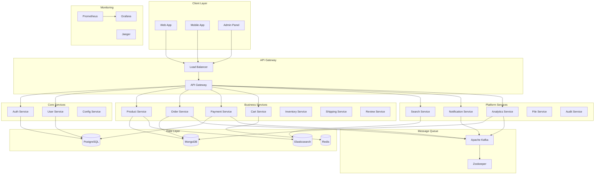

# UltraMarket Backend Architecture

## 🏗️ System Overview

UltraMarket is a comprehensive e-commerce platform built with a modern microservices architecture. The backend consists of 15+ microservices, each responsible for specific business domains and designed for scalability, reliability, and maintainability.

## 📊 Architecture Diagram



## 🏢 Service Architecture

### Core Services

#### 1. **API Gateway** (`api-gateway`)
- **Port**: 3000
- **Technology**: Node.js, Express, http-proxy-middleware
- **Responsibilities**:
  - Route requests to appropriate microservices
  - Authentication and authorization
  - Rate limiting and DDoS protection
  - Request/response logging
  - Load balancing
  - API documentation

#### 2. **Auth Service** (`auth-service`)
- **Port**: 3002
- **Technology**: Node.js, Express, JWT, bcrypt, Prisma
- **Database**: PostgreSQL
- **Responsibilities**:
  - User authentication and authorization
  - JWT token management
  - Password hashing and validation
  - User registration and login
  - Refresh token handling
  - Role-based access control (RBAC)
  - Email verification
  - Password reset functionality

#### 3. **User Service** (`user-service`)
- **Port**: 3001
- **Technology**: Node.js, Express, Prisma
- **Database**: PostgreSQL
- **Responsibilities**:
  - User profile management
  - User preferences and settings
  - Address management
  - User search and filtering
  - User analytics

### Business Services

#### 4. **Product Service** (`product-service`)
- **Port**: 3003
- **Technology**: Node.js, Express, Mongoose
- **Database**: MongoDB, Elasticsearch
- **Responsibilities**:
  - Product catalog management
  - Product search and filtering
  - Product variants and options
  - Inventory tracking
  - Product reviews and ratings
  - SEO optimization
  - Product analytics

#### 5. **Order Service** (`order-service`)
- **Port**: 3004
- **Technology**: Node.js, Express, Mongoose
- **Database**: MongoDB
- **Message Queue**: Apache Kafka
- **Responsibilities**:
  - Order creation and management
  - Order status tracking
  - Order history
  - Order analytics
  - Integration with payment and shipping
  - Order cancellation and refunds

#### 6. **Payment Service** (`payment-service`)
- **Port**: 3005
- **Technology**: Node.js, Express, Prisma
- **Database**: PostgreSQL
- **Integrations**: Stripe, PayPal
- **Responsibilities**:
  - Payment processing
  - Payment gateway integration
  - Refund management
  - Payment analytics
  - Fraud detection

#### 7. **Cart Service** (`cart-service`)
- **Port**: 3006
- **Technology**: Node.js, Express
- **Database**: Redis
- **Responsibilities**:
  - Shopping cart management
  - Cart persistence
  - Price calculations
  - Cart analytics

#### 8. **Inventory Service** (`inventory-service`)
- **Port**: 3007
- **Technology**: Node.js, Express, Mongoose
- **Database**: MongoDB
- **Responsibilities**:
  - Real-time inventory tracking
  - Stock management
  - Low stock alerts
  - Inventory analytics

#### 9. **Shipping Service** (`shipping-service`)
- **Port**: 3008
- **Technology**: Node.js, Express
- **Integrations**: Multiple shipping carriers
- **Responsibilities**:
  - Shipping rate calculation
  - Shipping method selection
  - Tracking information
  - Shipping analytics

### Platform Services

#### 10. **Search Service** (`search-service`)
- **Port**: 3009
- **Technology**: Node.js, Express
- **Database**: Elasticsearch
- **Responsibilities**:
  - Product search functionality
  - Search suggestions
  - Search analytics
  - Search optimization

#### 11. **Notification Service** (`notification-service`)
- **Port**: 3010
- **Technology**: Node.js, Express
- **Message Queue**: Apache Kafka
- **Integrations**: Email, SMS, Push notifications
- **Responsibilities**:
  - Email notifications
  - SMS notifications
  - Push notifications
  - Notification templates
  - Notification preferences

#### 12. **Analytics Service** (`analytics-service`)
- **Port**: 3011
- **Technology**: Node.js, Express
- **Database**: MongoDB
- **Message Queue**: Apache Kafka
- **Responsibilities**:
  - Business analytics
  - User behavior tracking
  - Sales analytics
  - Performance metrics
  - Custom reports

## 🗄️ Data Architecture

### Database Strategy

#### PostgreSQL (Primary Database)
- **Purpose**: User data, authentication, payments, orders
- **Schema**: Normalized relational data
- **Services**: Auth, User, Payment, Order
- **Backup**: Daily automated backups
- **Replication**: Master-slave configuration

#### MongoDB (Document Database)
- **Purpose**: Product catalog, orders, analytics
- **Schema**: Flexible document structure
- **Services**: Product, Order, Analytics
- **Indexing**: Optimized for search and queries
- **Sharding**: Horizontal scaling capability

#### Redis (Cache & Session Store)
- **Purpose**: Caching, sessions, real-time data
- **Services**: All services for caching
- **Features**: 
  - Session storage
  - API response caching
  - Real-time counters
  - Rate limiting

#### Elasticsearch (Search Engine)
- **Purpose**: Full-text search, product search
- **Services**: Product, Search
- **Features**:
  - Product search
  - Autocomplete
  - Search suggestions
  - Search analytics

### Message Queue Architecture

#### Apache Kafka
- **Purpose**: Asynchronous communication between services
- **Topics**:
  - `order-events`: Order status changes
  - `payment-events`: Payment processing events
  - `notification-events`: Notification triggers
  - `analytics-events`: Analytics data collection
- **Partitions**: Configurable based on throughput
- **Replication**: 3x replication for reliability

## 🔐 Security Architecture

### Authentication & Authorization

#### JWT Token Strategy
- **Access Token**: 15 minutes expiry
- **Refresh Token**: 7 days expiry
- **Token Rotation**: Automatic refresh token rotation
- **Token Revocation**: Blacklist mechanism

#### Role-Based Access Control (RBAC)
- **Roles**: CUSTOMER, ADMIN, VENDOR
- **Permissions**: Granular permission system
- **Resource-based**: Service-level permissions

#### Security Headers
- **Helmet.js**: Security headers
- **CORS**: Cross-origin resource sharing
- **Rate Limiting**: Per-user and per-IP limits
- **Input Validation**: Joi schema validation

### Data Protection

#### Encryption
- **At Rest**: Database encryption
- **In Transit**: TLS/SSL encryption
- **Passwords**: bcrypt hashing (12 rounds)

#### API Security
- **API Keys**: For external integrations
- **OAuth 2.0**: For third-party authentication
- **Webhook Signatures**: For payment callbacks

## 📊 Monitoring & Observability

### Metrics Collection

#### Prometheus Metrics
- **HTTP Metrics**: Request duration, status codes
- **Business Metrics**: Orders, revenue, user registrations
- **System Metrics**: CPU, memory, disk usage
- **Custom Metrics**: Service-specific metrics

#### Health Checks
- **Service Health**: /health endpoints
- **Database Connectivity**: Connection pool status
- **Dependencies**: External service health
- **Business Logic**: Critical business functions

### Logging Strategy

#### Structured Logging
- **Format**: JSON structured logs
- **Levels**: ERROR, WARN, INFO, DEBUG
- **Correlation**: Request ID tracking
- **Context**: User ID, session ID, service name

#### Log Aggregation
- **Centralized**: ELK stack or similar
- **Retention**: 30 days for production
- **Search**: Full-text search capabilities
- **Alerts**: Error rate monitoring

### Distributed Tracing

#### Jaeger Integration
- **Trace Propagation**: Across all services
- **Performance Analysis**: Request flow analysis
- **Error Tracking**: Error propagation tracking
- **Dependency Mapping**: Service dependency visualization

## 🚀 Deployment Architecture

### Container Strategy

#### Docker Containers
- **Base Images**: Node.js Alpine for efficiency
- **Multi-stage Builds**: Optimized production images
- **Security Scanning**: Automated vulnerability scanning
- **Image Signing**: Digital signature verification

#### Orchestration
- **Docker Compose**: Development environment
- **Kubernetes**: Production orchestration
- **Service Discovery**: Automatic service registration
- **Load Balancing**: Built-in load balancing

### Environment Management

#### Configuration Management
- **Environment Variables**: Service-specific configs
- **Secrets Management**: Secure secret storage
- **Feature Flags**: Runtime feature toggles
- **Configuration Validation**: Startup validation

#### Deployment Strategy
- **Blue-Green**: Zero-downtime deployments
- **Rolling Updates**: Gradual service updates
- **Canary Deployments**: Risk mitigation
- **Rollback Capability**: Quick rollback mechanism

## � Development Workflow

### Code Quality

#### Static Analysis
- **ESLint**: JavaScript/TypeScript linting
- **Prettier**: Code formatting
- **TypeScript**: Type safety
- **SonarQube**: Code quality analysis

#### Testing Strategy
- **Unit Tests**: 90%+ coverage target
- **Integration Tests**: Service integration testing
- **E2E Tests**: Full workflow testing
- **Performance Tests**: Load and stress testing

### CI/CD Pipeline

#### GitHub Actions
- **Build**: Multi-stage Docker builds
- **Test**: Automated test execution
- **Security**: Vulnerability scanning
- **Deploy**: Automated deployment

#### Quality Gates
- **Code Coverage**: Minimum 80%
- **Security Scan**: No critical vulnerabilities
- **Performance**: Response time thresholds
- **Integration Tests**: All tests passing

## 📈 Performance Optimization

### Caching Strategy

#### Redis Caching
- **API Responses**: Frequently accessed data
- **User Sessions**: Session storage
- **Product Data**: Product catalog caching
- **Search Results**: Search query caching

#### Database Optimization
- **Indexing**: Strategic database indexing
- **Query Optimization**: Efficient query patterns
- **Connection Pooling**: Optimized connection management
- **Read Replicas**: Read-heavy workloads

### Scalability Patterns

#### Horizontal Scaling
- **Service Replicas**: Multiple service instances
- **Load Balancing**: Traffic distribution
- **Database Sharding**: Data partitioning
- **CDN Integration**: Static content delivery

#### Performance Monitoring
- **Response Times**: P95, P99 latency tracking
- **Throughput**: Requests per second
- **Error Rates**: Error percentage monitoring
- **Resource Usage**: CPU, memory, disk monitoring

## 🛡️ Disaster Recovery

### Backup Strategy

#### Database Backups
- **PostgreSQL**: Daily full backups + WAL archiving
- **MongoDB**: Daily backups with oplog
- **Redis**: RDB snapshots + AOF persistence
- **Elasticsearch**: Index snapshots

#### Data Retention
- **Backup Retention**: 30 days for daily backups
- **Archive Retention**: 1 year for monthly archives
- **Compliance**: GDPR data retention policies
- **Recovery Testing**: Monthly recovery drills

### High Availability

#### Service Redundancy
- **Multiple Instances**: Service replication
- **Health Checks**: Automatic failure detection
- **Circuit Breakers**: Failure isolation
- **Graceful Degradation**: Partial service availability

#### Geographic Distribution
- **Multi-Region**: Geographic redundancy
- **CDN**: Global content delivery
- **Database Replication**: Cross-region replication
- **Load Balancing**: Geographic load balancing

## � API Design Patterns

### RESTful API Design

#### Resource-Based URLs
```
GET    /api/v1/products          # List products
POST   /api/v1/products          # Create product
GET    /api/v1/products/{id}     # Get product
PUT    /api/v1/products/{id}     # Update product
DELETE /api/v1/products/{id}     # Delete product
```

#### Standard Response Format
```json
{
  "success": true,
  "message": "Operation successful",
  "data": { ... },
  "pagination": {
    "page": 1,
    "limit": 20,
    "total": 100,
    "totalPages": 5
  }
}
```

#### Error Handling
```json
{
  "success": false,
  "error": {
    "code": "VALIDATION_ERROR",
    "message": "Invalid input data",
    "details": [ ... ]
  }
}
```

### GraphQL Integration

#### Schema Design
```graphql
type Product {
  id: ID!
  name: String!
  description: String!
  price: Float!
  category: Category!
  variants: [ProductVariant!]!
}

type Query {
  products(filter: ProductFilter): ProductConnection!
  product(id: ID!): Product
}
```

## � Future Enhancements

### Planned Improvements

#### Microservices Evolution
- **Event Sourcing**: Event-driven architecture
- **CQRS**: Command Query Responsibility Segregation
- **Saga Pattern**: Distributed transaction management
- **API Gateway**: Enhanced routing and filtering

#### Technology Upgrades
- **gRPC**: High-performance RPC
- **GraphQL**: Flexible data querying
- **WebSockets**: Real-time communication
- **Serverless**: Function-as-a-Service integration

#### Advanced Features
- **AI/ML Integration**: Recommendation engine
- **Real-time Analytics**: Live dashboard updates
- **Multi-tenancy**: SaaS platform capabilities
- **IoT Integration**: Connected device support

### Scalability Roadmap

#### Performance Targets
- **Response Time**: < 200ms for 95% of requests
- **Throughput**: 10,000+ requests per second
- **Availability**: 99.9% uptime
- **Concurrent Users**: 100,000+ simultaneous users

#### Infrastructure Evolution
- **Kubernetes**: Production orchestration
- **Service Mesh**: Istio for service communication
- **Observability**: Advanced monitoring and tracing
- **Security**: Zero-trust security model

---

## 📋 Implementation Checklist

### Phase 1: Core Services ✅
- [x] API Gateway implementation
- [x] Auth Service with JWT
- [x] User Service with profiles
- [x] Basic database setup

### Phase 2: Business Services ✅
- [x] Product Service with MongoDB
- [x] Order Service with status tracking
- [x] Payment Service integration
- [x] Cart Service with Redis

### Phase 3: Platform Services 🔄
- [ ] Search Service with Elasticsearch
- [ ] Notification Service with Kafka
- [ ] Analytics Service implementation
- [ ] File Service for uploads

### Phase 4: Monitoring & Security 🔄
- [ ] Prometheus metrics collection
- [ ] Grafana dashboards
- [ ] Jaeger distributed tracing
- [ ] Security hardening

### Phase 5: Production Deployment 🔄
- [ ] Kubernetes deployment
- [ ] CI/CD pipeline
- [ ] Load testing
- [ ] Performance optimization

---

*This architecture document is a living document and will be updated as the system evolves.*