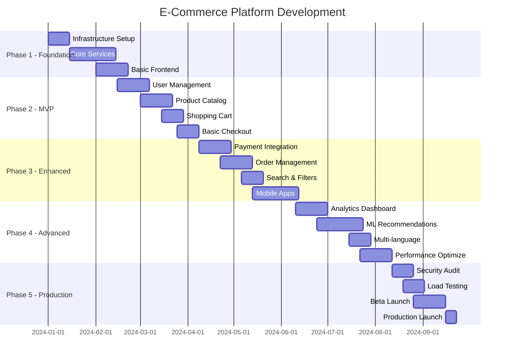

# E-Commerce Platform - To'liq Implementatsiya Rejasi

## 📋 Mundarija

1. [Loyiha Umumiy Ko'rinishi](#1-loyiha-umumiy-korinishi)
2. [Jamoa Tuzilishi](#2-jamoa-tuzilishi)
3. [Texnik Tayyorgarlik](#3-texnik-tayyorgarlik)
4. [Development Fazalari](#4-development-fazalari)
5. [Har Bir Faza Detallari](#5-har-bir-faza-detallari)
6. [Testing Strategiyasi](#6-testing-strategiyasi)
7. [Deployment Rejasi](#7-deployment-rejasi)
8. [Monitoring va Maintenance](#8-monitoring-va-maintenance)
9. [Risk Management](#9-risk-management)
10. [Byudjet Rejasi](#10-byudjet-rejasi)
11. [Muvaffaqiyat Kriteriylari](#11-muvaffaqiyat-kriteriylari)
12. [Haftalik Roadmap](#12-haftalik-roadmap)

---

## 1. Loyiha Umumiy Ko'rinishi

### 1.1 Loyiha Maqsadi
```yaml
Maqsad: Zamonaviy, scalable e-commerce platformasi
Foydalanuvchilar: 10M+ (potensial)
Tranzaksiyalar: 1M+ kunlik (maqsad)
Texnologiya: Cloud-native, microservices
Vaqt: 9-12 oy (to'liq platform)
```

### 1.2 Asosiy Deliverables
| Deliverable | Tavsif | Muhimlik |
|-------------|--------|----------|
| MVP | Asosiy e-commerce funksiyalari | Critical |
| Mobile Apps | iOS + Android | High |
| Admin Panel | Mahsulot va buyurtma boshqaruvi | Critical |
| Analytics | Real-time dashboards | Medium |
| ML Features | Recommendations, fraud detection | Medium |

---

## 2. Jamoa Tuzilishi

### 2.1 Core Team (Minimal)
```yaml
Technical Lead (1):
  - Arxitektura qarori
  - Code review
  - Technical mentoring
  - $80-120/soat yoki equity

Senior Backend Developer (2):
  - Microservices development
  - API design
  - Database optimization
  - $50-70/soat

Senior Frontend Developer (1):
  - React/Next.js
  - Mobile responsive
  - Performance optimization
  - $50-70/soat

Full-Stack Developer (2):
  - Feature development
  - Bug fixes
  - Integration
  - $40-50/soat

DevOps Engineer (1):
  - CI/CD setup
  - Kubernetes
  - Monitoring
  - $60-80/soat

QA Engineer (1):
  - Test automation
  - Manual testing
  - Performance testing
  - $30-40/soat
```

### 2.2 Extended Team (Scale-up)
```yaml
Mobile Developers (2):
  - React Native / Flutter
  - iOS + Android

UI/UX Designer (1):
  - Design system
  - User experience

Data Engineer (1):
  - Analytics pipeline
  - ML infrastructure

Security Engineer (1):
  - Security audits
  - Compliance
```

---

## 3. Texnik Tayyorgarlik

### 3.1 Development Environment Setup
```bash
# Week 1: Muhit tayyorlash

1. Version Control:
   - GitHub organization yaratish
   - Repository structure:
     /backend
       /user-service
       /product-service
       /order-service
       /payment-service
     /frontend
       /web-app
       /mobile-app
       /admin-panel
     /infrastructure
       /kubernetes
       /terraform
       /docker

2. CI/CD Pipeline:
   - GitHub Actions setup
   - Docker registry (DockerHub/ECR)
   - Kubernetes cluster (EKS/GKE)
   - ArgoCD for GitOps

3. Development Tools:
   - VS Code + extensions
   - Postman collections
   - Docker Desktop
   - kubectl, helm
```

### 3.2 Infrastructure Setup
```yaml
Week 2: Cloud Infrastructure

AWS Account Setup:
  - Multi-region VPC
  - EKS cluster (3 nodes minimum)
  - RDS PostgreSQL (Multi-AZ)
  - ElastiCache Redis
  - S3 buckets
  - CloudFront CDN

Monitoring Stack:
  - Prometheus + Grafana
  - ELK stack
  - Jaeger tracing
  - PagerDuty integration

Security:
  - WAF rules
  - Secrets Manager
  - IAM roles
  - VPN setup
```

---

## 4. Development Fazalari

### 4.1 Fazalar Overview


---

## 5. Har Bir Faza Detallari

### 5.1 Phase 1: Foundation (6 hafta)

#### Hafta 1-2: Infrastructure
```yaml
Tasks:
  - Cloud account setup
  - Kubernetes cluster
  - CI/CD pipeline
  - Monitoring stack

Deliverables:
  - Working K8s cluster
  - Automated deployments
  - Basic monitoring

Success Criteria:
  - Hello World app deployed
  - Metrics visible in Grafana
  - Logs in Elasticsearch
```

#### Hafta 3-4: Core Services
```yaml
Microservices Setup:
  User Service:
    - JWT authentication
    - User CRUD operations
    - PostgreSQL schema
    - Unit tests (80%+)
    
  Product Service:
    - Product CRUD
    - Category management
    - MongoDB setup
    - Image upload to S3
    
  API Gateway:
    - Kong/Nginx setup
    - Rate limiting
    - Request routing
    - CORS configuration
```

#### Hafta 5-6: Basic Frontend
```yaml
Frontend Foundation:
  - Next.js 13 setup
  - Tailwind CSS
  - Component library
  - State management (Redux)
  - API integration layer

Pages:
  - Home page
  - Product listing
  - Product detail
  - Login/Register
  - Basic navigation
```

### 5.2 Phase 2: MVP Features (6 hafta)

#### Hafta 7-9: User Management
```yaml
Features:
  Authentication:
    - Email/password login
    - Social login (Google, Facebook)
    - Password reset
    - Email verification
    
  User Profile:
    - Profile management
    - Address book
    - Order history
    - Wishlist
    
  Admin Users:
    - Role-based access
    - Admin dashboard
    - User management
```

#### Hafta 10-12: Product Catalog
```yaml
Product Management:
  - Advanced product schema
  - Variants (size, color)
  - Inventory tracking
  - Price management
  - Bulk import/export

Categories:
  - Hierarchical categories
  - Category filters
  - SEO-friendly URLs
  - Breadcrumbs

Media:
  - Multiple images
  - Image optimization
  - CDN integration
  - Video support
```

### 5.3 Phase 3: E-Commerce Core (8 hafta)

#### Hafta 13-15: Shopping Cart & Checkout
```yaml
Shopping Cart:
  - Add/remove items
  - Update quantities
  - Price calculation
  - Tax computation
  - Shipping estimates
  - Cart persistence
  - Guest checkout

Checkout Process:
  - Multi-step checkout
  - Address validation
  - Shipping methods
  - Payment selection
  - Order summary
```

#### Hafta 16-18: Payment Integration
```yaml
Payment Gateways:
  - Stripe integration
  - PayPal setup
  - Local payment methods
  - PCI compliance
  - Secure tokenization

Features:
  - Multiple payment methods
  - Saved cards
  - Payment webhooks
  - Refund processing
  - Invoice generation
```

#### Hafta 19-20: Order Management
```yaml
Order Processing:
  - Order creation
  - Status tracking
  - Email notifications
  - SMS alerts
  - Order history

Admin Features:
  - Order management
  - Status updates
  - Shipping labels
  - Bulk operations
  - Export functionality
```

### 5.4 Phase 4: Advanced Features (10 hafta)

#### Hafta 21-22: Search & Discovery
```yaml
Search Implementation:
  - Elasticsearch setup
  - Full-text search
  - Faceted search
  - Search suggestions
  - Typo tolerance

Filters:
  - Price range
  - Brand filter
  - Attributes
  - Ratings
  - Availability
```

#### Hafta 23-26: Mobile Applications
```yaml
Mobile Development:
  Technology: React Native
  
  Features:
    - Product browsing
    - User authentication
    - Shopping cart
    - Checkout
    - Push notifications
    - Offline mode
    - Biometric login
    
  Platforms:
    - iOS (iPhone, iPad)
    - Android (phones, tablets)
```

#### Hafta 27-28: Analytics Dashboard
```yaml
Analytics Implementation:
  - Real-time metrics
  - Sales reports
  - User behavior
  - Product performance
  - Custom dashboards

Technologies:
  - ClickHouse for OLAP
  - Grafana dashboards
  - Custom React dashboards
  - Export capabilities
```

#### Hafta 29-30: ML Features
```yaml
Machine Learning:
  Recommendation Engine:
    - Collaborative filtering
    - Content-based
    - Hybrid approach
    - A/B testing framework
    
  Other ML Features:
    - Price optimization
    - Demand forecasting
    - Customer segmentation
    - Fraud detection (basic)
```

### 5.5 Phase 5: Production Ready (6 hafta)

#### Hafta 31-32: Performance Optimization
```yaml
Optimization Tasks:
  Frontend:
    - Code splitting
    - Image optimization
    - CDN configuration
    - Service workers
    - Bundle size reduction
    
  Backend:
    - Query optimization
    - Caching strategy
    - Connection pooling
    - API response compression
    - Database indexing
```

#### Hafta 33-34: Security & Compliance
```yaml
Security Audit:
  - Penetration testing
  - OWASP compliance
  - Security headers
  - SSL/TLS setup
  - WAF rules

Compliance:
  - GDPR implementation
  - PCI DSS compliance
  - Privacy policy
  - Terms of service
  - Cookie consent
```

#### Hafta 35-36: Launch Preparation
```yaml
Pre-Launch:
  - Load testing (K6/JMeter)
  - Chaos testing
  - Backup procedures
  - Disaster recovery
  - Documentation

Beta Launch:
  - Limited users (100-500)
  - Feedback collection
  - Bug fixes
  - Performance monitoring
  - Gradual scaling
```

---

## 6. Testing Strategiyasi

### 6.1 Test Pyramid
```yaml
Unit Tests (70%):
  - Jest for JavaScript
  - JUnit for Java
  - pytest for Python
  - Coverage: >80%

Integration Tests (20%):
  - API testing (Postman/REST Assured)
  - Database integration
  - Service communication
  - Message queue testing

E2E Tests (10%):
  - Cypress for web
  - Detox for mobile
  - Critical user journeys
  - Cross-browser testing
```

### 6.2 Testing Schedule
```yaml
Continuous Testing:
  - Unit tests: Every commit
  - Integration: Every PR
  - E2E: Nightly builds
  - Performance: Weekly
  - Security: Bi-weekly

Manual Testing:
  - Feature testing
  - Exploratory testing
  - UAT sessions
  - Mobile device testing
```

---

## 7. Deployment Rejasi

### 7.1 Deployment Strategy
```yaml
Development Environment:
  - Feature branches
  - Automatic deployment
  - Isolated namespaces

Staging Environment:
  - Production mirror
  - Full dataset
  - Performance testing
  - Security scanning

Production Deployment:
  - Blue-green deployment
  - Canary releases (5% -> 25% -> 50% -> 100%)
  - Rollback plan
  - Health checks
```

### 7.2 Release Process
```yaml
Release Checklist:
  1. Code freeze
  2. Final testing
  3. Release notes
  4. Database migrations
  5. Deployment approval
  6. Monitoring alerts
  7. Go/No-go decision
  8. Deployment execution
  9. Smoke tests
  10. Monitoring period
```

---

## 8. Monitoring va Maintenance

### 8.1 Monitoring Stack
```yaml
Infrastructure Monitoring:
  - Prometheus + Grafana
  - Node/Pod metrics
  - Network monitoring
  - Storage monitoring

Application Monitoring:
  - APM (New Relic/DataDog)
  - Error tracking (Sentry)
  - Real user monitoring
  - Synthetic monitoring

Business Monitoring:
  - Sales metrics
  - Conversion rates
  - User activity
  - Performance KPIs
```

### 8.2 Maintenance Plan
```yaml
Regular Maintenance:
  Daily:
    - Log review
    - Alert check
    - Backup verification
    
  Weekly:
    - Security updates
    - Performance review
    - Capacity planning
    
  Monthly:
    - Dependency updates
    - Cost optimization
    - Architecture review
    - Team retrospective
```

---

## 9. Risk Management

### 9.1 Technical Risks
| Risk | Probability | Impact | Mitigation |
|------|------------|--------|------------|
| Scalability issues | Medium | High | Load testing, auto-scaling |
| Security breach | Low | Critical | Security audit, WAF, monitoring |
| Data loss | Low | Critical | Backup, disaster recovery |
| Vendor lock-in | Medium | Medium | Multi-cloud ready architecture |
| Technical debt | High | Medium | Regular refactoring, code reviews |

### 9.2 Business Risks
| Risk | Probability | Impact | Mitigation |
|------|------------|--------|------------|
| Budget overrun | Medium | High | Phased approach, MVP first |
| Timeline delay | Medium | Medium | Buffer time, parallel development |
| Team turnover | Medium | High | Documentation, knowledge sharing |
| Market changes | Low | Medium | Flexible architecture, A/B testing |

---

## 10. Byudjet Rejasi

### 10.1 Development Costs
```yaml
Team Costs (9 months):
  Technical Lead:      $50,000
  Backend Devs (2):    $120,000
  Frontend Dev:        $60,000
  Full-Stack (2):      $100,000
  DevOps:             $70,000
  QA:                 $40,000
  
  Total Team:         $440,000

Infrastructure Costs:
  AWS (Dev+Staging):   $2,000/month x 9 = $18,000
  AWS (Production):    $5,000/month x 3 = $15,000
  Tools & Services:    $1,000/month x 9 = $9,000
  
  Total Infra:        $42,000

Other Costs:
  Design/UX:          $20,000
  Security Audit:     $15,000
  Legal/Compliance:   $10,000
  Marketing (Beta):   $15,000
  
  Total Other:        $60,000

GRAND TOTAL:          $542,000
```

### 10.2 Cost Optimization
```yaml
Optimization Strategies:
  1. Start with MVP (reduce 40% initial cost)
  2. Use spot instances for dev/staging
  3. Reserved instances for production
  4. Offshore some development (save 30-50%)
  5. Open source tools where possible
  6. Gradual team scaling

Optimized Budget:
  MVP (3 months):     $150,000
  Scale-up (6 months): $250,000
  Total:              $400,000
```

---

## 11. Muvaffaqiyat Kriteriylari

### 11.1 Technical Success Metrics
```yaml
Performance:
  - Page load time: < 2 seconds
  - API response: < 100ms (p95)
  - Uptime: > 99.9%
  - Error rate: < 0.1%

Quality:
  - Code coverage: > 80%
  - No critical bugs
  - Security vulnerabilities: 0
  - Technical debt: < 10%

Scalability:
  - Support 10K concurrent users
  - Handle 1K orders/minute
  - Auto-scale within 2 minutes
  - Database response < 50ms
```

### 11.2 Business Success Metrics
```yaml
Launch Metrics (First 3 months):
  - Registered users: 10,000+
  - Active users: 2,000+ daily
  - Products listed: 5,000+
  - Orders: 100+ daily
  - Conversion rate: > 2%
  - Cart abandonment: < 70%

Growth Metrics (6-12 months):
  - Users: 100,000+
  - Revenue: $1M+ monthly
  - Mobile app installs: 50,000+
  - Customer satisfaction: > 4.5/5
  - Return rate: < 10%
```

---

## 12. Haftalik Roadmap

### 12.1 Birinchi 12 Hafta (MVP)

#### Hafta 1: Kickoff & Setup
```yaml
Monday-Tuesday:
  - Team onboarding
  - Tools access
  - Development environment
  - Architecture review

Wednesday-Thursday:
  - GitHub setup
  - CI/CD pipeline
  - Docker configs
  - Initial commits

Friday:
  - Team sync
  - Week review
  - Planning next week
```

#### Hafta 2: Infrastructure
```yaml
Core Tasks:
  - AWS account setup
  - VPC configuration
  - EKS cluster setup
  - RDS provisioning
  - Redis setup
  - S3 buckets
  - IAM roles

Deliverables:
  - Working K8s cluster
  - Database connections
  - Basic monitoring
```

#### Hafta 3-4: User Service
```yaml
Development:
  - User model design
  - Authentication API
  - JWT implementation
  - Password hashing
  - Email service
  - Unit tests
  - Integration tests

Endpoints:
  - POST /auth/register
  - POST /auth/login
  - POST /auth/refresh
  - GET /users/profile
  - PUT /users/profile
  - POST /auth/forgot-password
```

#### Hafta 5-6: Product Service
```yaml
Development:
  - Product schema
  - Category structure
  - MongoDB setup
  - Image upload
  - CRUD operations
  - Search basics

Endpoints:
  - GET /products
  - GET /products/:id
  - POST /products (admin)
  - PUT /products/:id (admin)
  - DELETE /products/:id (admin)
  - GET /categories
```

#### Hafta 7-8: Frontend Foundation
```yaml
Setup:
  - Next.js 13 project
  - Tailwind CSS
  - Redux Toolkit
  - Axios setup
  - ESLint/Prettier

Pages:
  - Landing page
  - Product grid
  - Product detail
  - Login/Register
  - User dashboard
  - Responsive design
```

#### Hafta 9-10: Shopping Cart
```yaml
Backend:
  - Cart service
  - Session management
  - Price calculation
  - Redis caching

Frontend:
  - Add to cart
  - Cart page
  - Quantity update
  - Remove items
  - Cart persistence
```

#### Hafta 11-12: Basic Checkout
```yaml
Features:
  - Checkout flow
  - Address form
  - Order creation
  - Email confirmation
  - Basic payment (Stripe)
  - Order history

MVP Complete:
  - Demo preparation
  - Bug fixes
  - Performance check
  - Deploy to staging
```

### 12.2 Keyingi Fazalar Plani

```yaml
Hafta 13-24: Enhanced Features
  - Payment integration
  - Order management
  - Search implementation
  - Mobile app start

Hafta 25-36: Advanced & Polish
  - ML features
  - Analytics
  - Performance optimization
  - Security hardening
  - Beta testing
  - Production launch
```

---

## 📋 Kunlik Checklist Template

### Daily Standup Questions
```yaml
1. Kecha nima qildim?
2. Bugun nima qilaman?
3. Qanday blokerlar bor?
```

### Daily Tasks Monitoring
```yaml
Morning (9:00-12:00):
  □ Check CI/CD status
  □ Review overnight alerts
  □ Team standup (9:30)
  □ Code development

Afternoon (13:00-18:00):
  □ Code review
  □ Testing
  □ Documentation update
  □ Next day planning

Evening checklist:
  □ Commit code
  □ Update JIRA
  □ Check test results
  □ Push to repository
```

---

## 🚀 Start Commands

```bash
# Clone repositories
git clone https://github.com/your-org/ecommerce-platform
cd ecommerce-platform

# Setup development environment
make setup-dev

# Start local services
docker-compose up -d

# Run microservices
cd backend/user-service && npm run dev
cd backend/product-service && npm run dev
cd frontend/web-app && npm run dev

# Access applications
# Frontend: http://localhost:3000
# API Gateway: http://localhost:8000
# Grafana: http://localhost:3001
# Kibana: http://localhost:5601
```

---

## ✅ Final Checklist

### Pre-Launch Checklist
```yaml
Technical:
  □ All tests passing
  □ Security audit completed
  □ Performance benchmarks met
  □ Backup system tested
  □ Monitoring configured
  □ Documentation complete

Business:
  □ Legal compliance verified
  □ Payment gateway approved
  □ Support team trained
  □ Marketing materials ready
  □ Launch plan approved

Operations:
  □ On-call rotation set
  □ Runbooks prepared
  □ Incident response tested
  □ Scaling tested
  □ Rollback plan ready
```

---

## 📞 Emergency Contacts

```yaml
Technical Issues:
  - Tech Lead: [Phone/Slack]
  - DevOps: [Phone/Slack]
  - AWS Support: [Case number]

Business Critical:
  - Product Owner: [Phone]
  - CEO/CTO: [Phone]
  - Legal: [Phone]
```

---

**Document Version:** 1.0  
**Last Updated:** 2024  
**Next Review:** Weekly during development  
**Owner:** Technical Lead

---

## 🎯 MUHIM ESLATMA

Bu reja **100% muvaffaqiyatli** bo'lishi uchun:

1. **Haftalik progress review** majburiy
2. **Daily standups** o'tkazib yuborilmasin
3. **Documentation** har doim yangilansin
4. **Testing** hech qachon skip qilinmasin
5. **Security** har bir qarordan birinchi o'rinda

**Tayyor bo'lsangiz, 1-haftadan boshlaymiz!** 🚀 