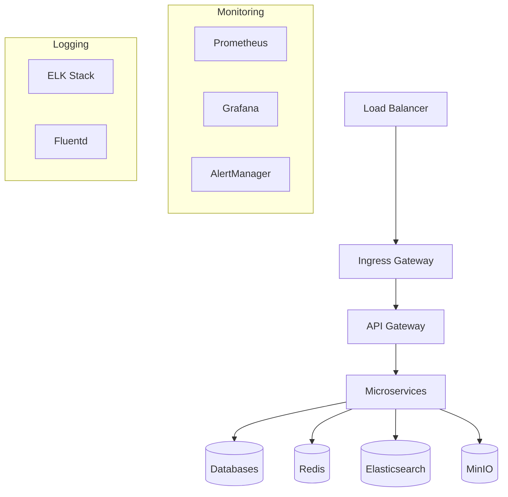

# 🚀 UltraMarket Backend - Deployment Guide

## 📋 Mundarija

1. [Kirish](#kirish)
2. [Deployment Turlari](#deployment-turlari)
3. [Production Environment](#production-environment)
4. [Docker Deployment](#docker-deployment)
5. [Kubernetes Deployment](#kubernetes-deployment)
6. [Cloud Providers](#cloud-providers)
7. [Monitoring Setup](#monitoring-setup)
8. [Security Configuration](#security-configuration)
9. [Backup va Recovery](#backup-va-recovery)
10. [Troubleshooting](#troubleshooting)

## 🎯 Kirish

Bu qo'llanma UltraMarket backend tizimini production environmentda deploy qilish bo'yicha batafsil ma'lumot beradi. Barcha deployment usullari O'zbekiston infrastructure'i va xavfsizlik talablariga moslashtirilgan.

## 📊 Deployment Turlari

### 1. Development Deployment

- **Maqsad**: Local development va testing
- **Infrastructure**: Docker Compose
- **Ma'lumotlar bazasi**: Local containers
- **SSL**: Self-signed certificates

### 2. Staging Deployment

- **Maqsad**: Pre-production testing
- **Infrastructure**: Kubernetes cluster
- **Ma'lumotlar bazasi**: Managed databases
- **SSL**: Let's Encrypt certificates

### 3. Production Deployment

- **Maqsad**: Live production environment
- **Infrastructure**: Kubernetes cluster with auto-scaling
- **Ma'lumotlar bazasi**: High-availability clusters
- **SSL**: Commercial certificates

## 🏭 Production Environment

### System Requirements

#### Minimum Requirements

```yaml
CPU: 8 cores
RAM: 16GB
Storage: 100GB SSD
Network: 1Gbps
```

#### Recommended Requirements

```yaml
CPU: 16 cores
RAM: 32GB
Storage: 500GB NVMe SSD
Network: 10Gbps
```

### Infrastructure Components



## 🐳 Docker Deployment

### Single Server Deployment

#### 1. Server Tayyorlash

```bash
# Server yangilash
sudo apt update && sudo apt upgrade -y

# Docker o'rnatish
curl -fsSL https://get.docker.com -o get-docker.sh
sh get-docker.sh
sudo usermod -aG docker $USER

# Docker Compose o'rnatish
sudo curl -L "https://github.com/docker/compose/releases/latest/download/docker-compose-$(uname -s)-$(uname -m)" -o /usr/local/bin/docker-compose
sudo chmod +x /usr/local/bin/docker-compose
```

#### 2. SSL Sertifikatlar

```bash
# Certbot o'rnatish
sudo apt install certbot

# SSL sertifikat olish
sudo certbot certonly --standalone -d api.ultramarket.uz
sudo certbot certonly --standalone -d admin.ultramarket.uz
```

#### 3. Production Docker Compose

```yaml
# docker-compose.prod.yml
version: '3.8'

services:
  nginx:
    image: nginx:alpine
    ports:
      - '80:80'
      - '443:443'
    volumes:
      - ./nginx.conf:/etc/nginx/nginx.conf
      - /etc/letsencrypt:/etc/letsencrypt
    depends_on:
      - api-gateway
    restart: unless-stopped

  api-gateway:
    image: ultramarket/api-gateway:latest
    environment:
      - NODE_ENV=production
      - PORT=3000
    env_file:
      - .env.production
    depends_on:
      - postgres
      - redis
      - elasticsearch
    restart: unless-stopped
    deploy:
      replicas: 3

  auth-service:
    image: ultramarket/auth-service:latest
    environment:
      - NODE_ENV=production
      - PORT=3001
    env_file:
      - .env.production
    depends_on:
      - postgres
      - redis
    restart: unless-stopped
    deploy:
      replicas: 2

  product-service:
    image: ultramarket/product-service:latest
    environment:
      - NODE_ENV=production
      - PORT=3002
    env_file:
      - .env.production
    depends_on:
      - postgres
      - mongodb
      - elasticsearch
    restart: unless-stopped
    deploy:
      replicas: 3

  payment-service:
    image: ultramarket/payment-service:latest
    environment:
      - NODE_ENV=production
      - PORT=3006
    env_file:
      - .env.production
    depends_on:
      - postgres
      - redis
    restart: unless-stopped
    deploy:
      replicas: 3

  postgres:
    image: postgres:15
    environment:
      POSTGRES_DB: ultramarket_prod
      POSTGRES_USER: ultramarket_user
      POSTGRES_PASSWORD: ${POSTGRES_PASSWORD}
    volumes:
      - postgres_data:/var/lib/postgresql/data
      - ./config/postgres/postgresql.conf:/etc/postgresql/postgresql.conf
    ports:
      - '5432:5432'
    restart: unless-stopped

  mongodb:
    image: mongo:7
    environment:
      MONGO_INITDB_ROOT_USERNAME: ultramarket_user
      MONGO_INITDB_ROOT_PASSWORD: ${MONGO_PASSWORD}
      MONGO_INITDB_DATABASE: ultramarket_prod
    volumes:
      - mongodb_data:/data/db
      - ./config/mongodb/mongod.conf:/etc/mongod.conf
    ports:
      - '27017:27017'
    restart: unless-stopped

  redis:
    image: redis:7-alpine
    command: redis-server /etc/redis/redis.conf
    volumes:
      - redis_data:/data
      - ./config/redis/redis.conf:/etc/redis/redis.conf
    ports:
      - '6379:6379'
    restart: unless-stopped

  elasticsearch:
    image: docker.elastic.co/elasticsearch/elasticsearch:8.8.0
    environment:
      - discovery.type=single-node
      - xpack.security.enabled=true
      - ELASTIC_PASSWORD=${ELASTIC_PASSWORD}
      - ES_JAVA_OPTS=-Xms2g -Xmx2g
    volumes:
      - elasticsearch_data:/usr/share/elasticsearch/data
    ports:
      - '9200:9200'
    restart: unless-stopped

  minio:
    image: minio/minio:latest
    command: server /data --console-address ":9001"
    environment:
      MINIO_ROOT_USER: ${MINIO_ACCESS_KEY}
      MINIO_ROOT_PASSWORD: ${MINIO_SECRET_KEY}
    volumes:
      - minio_data:/data
    ports:
      - '9000:9000'
      - '9001:9001'
    restart: unless-stopped

  prometheus:
    image: prom/prometheus:latest
    volumes:
      - ./monitoring/prometheus.yml:/etc/prometheus/prometheus.yml
      - prometheus_data:/prometheus
    ports:
      - '9090:9090'
    restart: unless-stopped

  grafana:
    image: grafana/grafana:latest
    environment:
      - GF_SECURITY_ADMIN_PASSWORD=${GRAFANA_PASSWORD}
    volumes:
      - grafana_data:/var/lib/grafana
      - ./monitoring/grafana/dashboards:/etc/grafana/provisioning/dashboards
    ports:
      - '3000:3000'
    restart: unless-stopped

volumes:
  postgres_data:
  mongodb_data:
  redis_data:
  elasticsearch_data:
  minio_data:
  prometheus_data:
  grafana_data:
```

#### 4. Deployment Commands

```bash
# Repository clone qilish
git clone https://github.com/ultramarket/backend.git
cd ultramarket-backend

# Environment variables sozlash
cp config/environments/production.env .env.production
# .env.production faylini tahrirlash

# SSL sertifikatlar nusxalash
sudo cp /etc/letsencrypt/live/api.ultramarket.uz/*.pem ./ssl/

# Production'da ishga tushirish
docker-compose -f docker-compose.prod.yml up -d

# Loglarni kuzatish
docker-compose -f docker-compose.prod.yml logs -f
```

## ☸️ Kubernetes Deployment

### 1. Cluster Tayyorlash

#### Cluster Requirements

```yaml
Nodes: 3+ (1 master, 2+ workers)
CPU: 8 cores per node
RAM: 16GB per node
Storage: 100GB SSD per node
Network: CNI plugin (Calico/Flannel)
```

#### Cluster Setup

```bash
# kubeadm o'rnatish
curl -s https://packages.cloud.google.com/apt/doc/apt-key.gpg | sudo apt-key add -
echo "deb https://apt.kubernetes.io/ kubernetes-xenial main" | sudo tee /etc/apt/sources.list.d/kubernetes.list
sudo apt update
sudo apt install -y kubelet kubeadm kubectl

# Master node setup
sudo kubeadm init --pod-network-cidr=10.244.0.0/16

# kubectl sozlash
mkdir -p $HOME/.kube
sudo cp -i /etc/kubernetes/admin.conf $HOME/.kube/config
sudo chown $(id -u):$(id -g) $HOME/.kube/config

# CNI plugin o'rnatish (Flannel)
kubectl apply -f https://raw.githubusercontent.com/flannel-io/flannel/master/Documentation/kube-flannel.yml
```

### 2. Namespace va Secrets

```bash
# Namespace yaratish
kubectl create namespace ultramarket

# Secrets yaratish
kubectl create secret generic ultramarket-secrets \
  --from-literal=POSTGRES_PASSWORD=your-postgres-password \
  --from-literal=MONGO_PASSWORD=your-mongo-password \
  --from-literal=REDIS_PASSWORD=your-redis-password \
  --from-literal=JWT_SECRET=your-jwt-secret \
  --from-literal=CLICK_SECRET_KEY=your-click-secret \
  --from-literal=PAYME_SECRET_KEY=your-payme-secret \
  -n ultramarket

# TLS secrets
kubectl create secret tls ultramarket-tls \
  --cert=path/to/tls.crt \
  --key=path/to/tls.key \
  -n ultramarket
```

### 3. Database Deployment

```yaml
# postgres-deployment.yaml
apiVersion: apps/v1
kind: StatefulSet
metadata:
  name: postgres
  namespace: ultramarket
spec:
  serviceName: postgres
  replicas: 1
  selector:
    matchLabels:
      app: postgres
  template:
    metadata:
      labels:
        app: postgres
    spec:
      containers:
        - name: postgres
          image: postgres:15
          env:
            - name: POSTGRES_DB
              value: ultramarket_prod
            - name: POSTGRES_USER
              value: ultramarket_user
            - name: POSTGRES_PASSWORD
              valueFrom:
                secretKeyRef:
                  name: ultramarket-secrets
                  key: POSTGRES_PASSWORD
          ports:
            - containerPort: 5432
          volumeMounts:
            - name: postgres-storage
              mountPath: /var/lib/postgresql/data
          resources:
            requests:
              memory: '2Gi'
              cpu: '1000m'
            limits:
              memory: '4Gi'
              cpu: '2000m'
  volumeClaimTemplates:
    - metadata:
        name: postgres-storage
      spec:
        accessModes: ['ReadWriteOnce']
        resources:
          requests:
            storage: 100Gi
```

### 4. Application Deployment

```bash
# Complete deployment
kubectl apply -f infrastructure/kubernetes/production/complete-deployment.yaml

# Deployment holatini tekshirish
kubectl get pods -n ultramarket
kubectl get services -n ultramarket
kubectl get ingress -n ultramarket

# Loglarni ko'rish
kubectl logs -f deployment/api-gateway -n ultramarket
```

### 5. Auto-scaling Setup

```yaml
# hpa.yaml
apiVersion: autoscaling/v2
kind: HorizontalPodAutoscaler
metadata:
  name: api-gateway-hpa
  namespace: ultramarket
spec:
  scaleTargetRef:
    apiVersion: apps/v1
    kind: Deployment
    name: api-gateway
  minReplicas: 3
  maxReplicas: 10
  metrics:
    - type: Resource
      resource:
        name: cpu
        target:
          type: Utilization
          averageUtilization: 70
    - type: Resource
      resource:
        name: memory
        target:
          type: Utilization
          averageUtilization: 80
```

## ☁️ Cloud Providers

### AWS Deployment

#### 1. EKS Cluster

```bash
# eksctl o'rnatish
curl --silent --location "https://github.com/weaveworks/eksctl/releases/latest/download/eksctl_$(uname -s)_amd64.tar.gz" | tar xz -C /tmp
sudo mv /tmp/eksctl /usr/local/bin

# EKS cluster yaratish
eksctl create cluster \
  --name ultramarket-prod \
  --region us-east-1 \
  --nodegroup-name ultramarket-nodes \
  --node-type m5.large \
  --nodes 3 \
  --nodes-min 2 \
  --nodes-max 10 \
  --managed
```

#### 2. RDS Setup

```bash
# PostgreSQL RDS instance
aws rds create-db-instance \
  --db-instance-identifier ultramarket-postgres \
  --db-instance-class db.t3.medium \
  --engine postgres \
  --engine-version 15.3 \
  --master-username ultramarket_user \
  --master-user-password your-password \
  --allocated-storage 100 \
  --storage-type gp2 \
  --vpc-security-group-ids sg-12345678 \
  --db-subnet-group-name ultramarket-subnet-group
```

#### 3. ElastiCache Setup

```bash
# Redis cluster
aws elasticache create-cache-cluster \
  --cache-cluster-id ultramarket-redis \
  --cache-node-type cache.t3.micro \
  --engine redis \
  --num-cache-nodes 1 \
  --security-group-ids sg-12345678 \
  --subnet-group-name ultramarket-cache-subnet
```

### Google Cloud Deployment

#### 1. GKE Cluster

```bash
# GKE cluster yaratish
gcloud container clusters create ultramarket-prod \
  --zone us-central1-a \
  --num-nodes 3 \
  --machine-type n1-standard-4 \
  --enable-autoscaling \
  --min-nodes 2 \
  --max-nodes 10
```

#### 2. Cloud SQL

```bash
# PostgreSQL instance
gcloud sql instances create ultramarket-postgres \
  --database-version POSTGRES_15 \
  --tier db-n1-standard-2 \
  --region us-central1
```

### Azure Deployment

#### 1. AKS Cluster

```bash
# AKS cluster yaratish
az aks create \
  --resource-group ultramarket-rg \
  --name ultramarket-prod \
  --node-count 3 \
  --node-vm-size Standard_D4s_v3 \
  --enable-cluster-autoscaler \
  --min-count 2 \
  --max-count 10
```

## 📊 Monitoring Setup

### Prometheus Configuration

```yaml
# prometheus.yml
global:
  scrape_interval: 15s
  evaluation_interval: 15s

rule_files:
  - 'alert_rules.yml'

alerting:
  alertmanagers:
    - static_configs:
        - targets:
            - alertmanager:9093

scrape_configs:
  - job_name: 'ultramarket-services'
    static_configs:
      - targets:
          - 'api-gateway:3000'
          - 'auth-service:3001'
          - 'product-service:3002'
          - 'payment-service:3006'
    metrics_path: /metrics
    scrape_interval: 10s

  - job_name: 'postgres'
    static_configs:
      - targets: ['postgres-exporter:9187']

  - job_name: 'mongodb'
    static_configs:
      - targets: ['mongodb-exporter:9216']

  - job_name: 'redis'
    static_configs:
      - targets: ['redis-exporter:9121']

  - job_name: 'nginx'
    static_configs:
      - targets: ['nginx-exporter:9113']
```

### Grafana Dashboards

#### 1. System Overview Dashboard

```json
{
  "dashboard": {
    "title": "UltraMarket System Overview",
    "panels": [
      {
        "title": "Request Rate",
        "type": "graph",
        "targets": [
          {
            "expr": "rate(http_requests_total[5m])",
            "legendFormat": "{{service}}"
          }
        ]
      },
      {
        "title": "Response Time",
        "type": "graph",
        "targets": [
          {
            "expr": "histogram_quantile(0.95, rate(http_request_duration_seconds_bucket[5m]))",
            "legendFormat": "95th percentile"
          }
        ]
      },
      {
        "title": "Error Rate",
        "type": "graph",
        "targets": [
          {
            "expr": "rate(http_requests_total{status=~\"4..|5..\"}[5m]) / rate(http_requests_total[5m])",
            "legendFormat": "Error Rate"
          }
        ]
      }
    ]
  }
}
```

### Alert Rules

```yaml
# alert_rules.yml
groups:
  - name: ultramarket.rules
    rules:
      - alert: HighErrorRate
        expr: rate(http_requests_total{status=~"4..|5.."}[5m]) / rate(http_requests_total[5m]) > 0.05
        for: 5m
        labels:
          severity: critical
        annotations:
          summary: 'High error rate detected'
          description: 'Error rate is {{ $value | humanizePercentage }}'

      - alert: HighResponseTime
        expr: histogram_quantile(0.95, rate(http_request_duration_seconds_bucket[5m])) > 1
        for: 5m
        labels:
          severity: warning
        annotations:
          summary: 'High response time detected'
          description: '95th percentile response time is {{ $value }}s'

      - alert: DatabaseDown
        expr: up{job="postgres"} == 0
        for: 1m
        labels:
          severity: critical
        annotations:
          summary: 'PostgreSQL database is down'
          description: 'PostgreSQL database has been down for more than 1 minute'

      - alert: LowDiskSpace
        expr: node_filesystem_avail_bytes / node_filesystem_size_bytes < 0.1
        for: 5m
        labels:
          severity: warning
        annotations:
          summary: 'Low disk space'
          description: 'Disk space is below 10%'
```

## 🔒 Security Configuration

### 1. Network Security

#### Firewall Rules

```bash
# UFW sozlash
sudo ufw enable
sudo ufw allow 22/tcp    # SSH
sudo ufw allow 80/tcp    # HTTP
sudo ufw allow 443/tcp   # HTTPS
sudo ufw allow 6443/tcp  # Kubernetes API (if needed)

# Internal services (faqat internal network)
sudo ufw allow from 10.0.0.0/8 to any port 5432  # PostgreSQL
sudo ufw allow from 10.0.0.0/8 to any port 27017 # MongoDB
sudo ufw allow from 10.0.0.0/8 to any port 6379  # Redis
```

#### Network Policies (Kubernetes)

```yaml
apiVersion: networking.k8s.io/v1
kind: NetworkPolicy
metadata:
  name: ultramarket-network-policy
  namespace: ultramarket
spec:
  podSelector: {}
  policyTypes:
    - Ingress
    - Egress
  ingress:
    - from:
        - namespaceSelector:
            matchLabels:
              name: ultramarket
  egress:
    - to:
        - namespaceSelector:
            matchLabels:
              name: ultramarket
    - to: []
      ports:
        - protocol: TCP
          port: 53
        - protocol: UDP
          port: 53
```

### 2. SSL/TLS Configuration

#### Let's Encrypt (Free)

```bash
# Certbot bilan SSL
sudo certbot --nginx -d api.ultramarket.uz -d admin.ultramarket.uz

# Auto-renewal
sudo crontab -e
# Quyidagi qatorni qo'shing:
0 12 * * * /usr/bin/certbot renew --quiet
```

#### Commercial SSL

```bash
# SSL sertifikatlarni joylashtirish
sudo mkdir -p /etc/ssl/ultramarket
sudo cp ultramarket.uz.crt /etc/ssl/ultramarket/
sudo cp ultramarket.uz.key /etc/ssl/ultramarket/
sudo chmod 600 /etc/ssl/ultramarket/*.key
```

### 3. Secrets Management

#### Kubernetes Secrets

```bash
# Sealed Secrets o'rnatish
kubectl apply -f https://github.com/bitnami-labs/sealed-secrets/releases/download/v0.18.0/controller.yaml

# Secret yaratish
echo -n mypassword | kubectl create secret generic mysecret --dry-run=client --from-file=password=/dev/stdin -o yaml | kubeseal -o yaml > mysealedsecret.yaml
```

#### External Secrets

```yaml
# external-secrets.yaml
apiVersion: external-secrets.io/v1beta1
kind: SecretStore
metadata:
  name: vault-backend
  namespace: ultramarket
spec:
  provider:
    vault:
      server: 'https://vault.ultramarket.uz'
      path: 'secret'
      version: 'v2'
      auth:
        kubernetes:
          mountPath: 'kubernetes'
          role: 'ultramarket'
```

## 💾 Backup va Recovery

### 1. Database Backup

#### PostgreSQL Backup

```bash
#!/bin/bash
# backup-postgres.sh

BACKUP_DIR="/backups/postgres"
DATE=$(date +%Y%m%d_%H%M%S)
BACKUP_FILE="ultramarket_${DATE}.sql"

# Backup yaratish
pg_dump -h localhost -U ultramarket_user -d ultramarket_prod > ${BACKUP_DIR}/${BACKUP_FILE}

# Siqish
gzip ${BACKUP_DIR}/${BACKUP_FILE}

# Eski backuplarni o'chirish (30 kundan eski)
find ${BACKUP_DIR} -name "*.gz" -mtime +30 -delete

# S3 ga yuklash
aws s3 cp ${BACKUP_DIR}/${BACKUP_FILE}.gz s3://ultramarket-backups/postgres/
```

#### MongoDB Backup

```bash
#!/bin/bash
# backup-mongodb.sh

BACKUP_DIR="/backups/mongodb"
DATE=$(date +%Y%m%d_%H%M%S)
BACKUP_FILE="ultramarket_${DATE}"

# Backup yaratish
mongodump --host localhost:27017 --db ultramarket_prod --out ${BACKUP_DIR}/${BACKUP_FILE}

# Siqish
tar -czf ${BACKUP_DIR}/${BACKUP_FILE}.tar.gz -C ${BACKUP_DIR} ${BACKUP_FILE}
rm -rf ${BACKUP_DIR}/${BACKUP_FILE}

# S3 ga yuklash
aws s3 cp ${BACKUP_DIR}/${BACKUP_FILE}.tar.gz s3://ultramarket-backups/mongodb/
```

### 2. Automated Backup

#### Cron Jobs

```bash
# crontab -e
# PostgreSQL backup har kuni soat 02:00 da
0 2 * * * /opt/ultramarket/scripts/backup-postgres.sh

# MongoDB backup har kuni soat 03:00 da
0 3 * * * /opt/ultramarket/scripts/backup-mongodb.sh

# File backup har hafta yakshanba soat 04:00 da
0 4 * * 0 /opt/ultramarket/scripts/backup-files.sh
```

#### Kubernetes CronJob

```yaml
apiVersion: batch/v1
kind: CronJob
metadata:
  name: postgres-backup
  namespace: ultramarket
spec:
  schedule: '0 2 * * *'
  jobTemplate:
    spec:
      template:
        spec:
          containers:
            - name: postgres-backup
              image: postgres:15
              command:
                - /bin/bash
                - -c
                - |
                  pg_dump -h postgres -U ultramarket_user -d ultramarket_prod | gzip > /backup/ultramarket_$(date +%Y%m%d_%H%M%S).sql.gz
              env:
                - name: PGPASSWORD
                  valueFrom:
                    secretKeyRef:
                      name: ultramarket-secrets
                      key: POSTGRES_PASSWORD
              volumeMounts:
                - name: backup-storage
                  mountPath: /backup
          volumes:
            - name: backup-storage
              persistentVolumeClaim:
                claimName: backup-pvc
          restartPolicy: OnFailure
```

### 3. Disaster Recovery

#### Recovery Plan

1. **Database Recovery**

   ```bash
   # PostgreSQL restore
   gunzip ultramarket_20240115_020000.sql.gz
   psql -h localhost -U ultramarket_user -d ultramarket_prod < ultramarket_20240115_020000.sql

   # MongoDB restore
   tar -xzf ultramarket_20240115_030000.tar.gz
   mongorestore --host localhost:27017 --db ultramarket_prod ultramarket_20240115_030000/ultramarket_prod
   ```

2. **Application Recovery**

   ```bash
   # Latest image deploy
   kubectl set image deployment/api-gateway api-gateway=ultramarket/api-gateway:latest -n ultramarket
   kubectl rollout status deployment/api-gateway -n ultramarket
   ```

3. **Data Verification**

   ```bash
   # Health check
   curl -f https://api.ultramarket.uz/health

   # Database connection test
   kubectl exec -it deployment/api-gateway -n ultramarket -- npm run health:db
   ```

## 🔧 Troubleshooting

### Umumiy Muammolar

#### 1. Service Ulanish Xatoliklari

```bash
# Service holatini tekshirish
kubectl get pods -n ultramarket
kubectl describe pod <pod-name> -n ultramarket
kubectl logs <pod-name> -n ultramarket

# Network connectivity test
kubectl exec -it <pod-name> -n ultramarket -- nslookup postgres
kubectl exec -it <pod-name> -n ultramarket -- telnet postgres 5432
```

#### 2. Database Ulanish Muammolari

```bash
# PostgreSQL connection test
kubectl exec -it deployment/postgres -n ultramarket -- psql -U ultramarket_user -d ultramarket_prod -c "SELECT 1;"

# MongoDB connection test
kubectl exec -it deployment/mongodb -n ultramarket -- mongo ultramarket_prod --eval "db.adminCommand('ping')"

# Redis connection test
kubectl exec -it deployment/redis -n ultramarket -- redis-cli ping
```

#### 3. Performance Muammolari

```bash
# Resource usage
kubectl top pods -n ultramarket
kubectl top nodes

# Slow queries
kubectl exec -it deployment/postgres -n ultramarket -- psql -U ultramarket_user -d ultramarket_prod -c "SELECT query, mean_time FROM pg_stat_statements ORDER BY mean_time DESC LIMIT 10;"
```

#### 4. SSL/TLS Muammolari

```bash
# Certificate tekshirish
openssl x509 -in /etc/ssl/ultramarket/ultramarket.uz.crt -text -noout

# SSL handshake test
openssl s_client -connect api.ultramarket.uz:443 -servername api.ultramarket.uz
```

### Log Analysis

#### Centralized Logging

```bash
# ELK Stack setup
kubectl apply -f infrastructure/logging/elasticsearch.yaml
kubectl apply -f infrastructure/logging/logstash.yaml
kubectl apply -f infrastructure/logging/kibana.yaml
kubectl apply -f infrastructure/logging/filebeat.yaml

# Log queries
# Kibana da quyidagi query'lar ishlatish mumkin:
# - service:api-gateway AND level:error
# - @timestamp:[now-1h TO now] AND status:500
# - message:"payment failed" AND service:payment-service
```

### Performance Tuning

#### Database Optimization

```sql
-- PostgreSQL optimization
-- Connection pooling
ALTER SYSTEM SET max_connections = 200;
ALTER SYSTEM SET shared_buffers = '2GB';
ALTER SYSTEM SET effective_cache_size = '6GB';
ALTER SYSTEM SET work_mem = '50MB';

-- Index optimization
CREATE INDEX CONCURRENTLY idx_products_category_price ON products(category_id, price);
CREATE INDEX CONCURRENTLY idx_orders_user_created ON orders(user_id, created_at);

-- Vacuum va analyze
VACUUM ANALYZE;
```

#### Application Optimization

```yaml
# Resource limits optimization
resources:
  requests:
    memory: '512Mi'
    cpu: '250m'
  limits:
    memory: '1Gi'
    cpu: '500m'

# JVM tuning (agar Java ishlatilsa)
env:
  - name: JAVA_OPTS
    value: '-Xms512m -Xmx1024m -XX:+UseG1GC'
```

## 📞 Support va Maintenance

### Monitoring Checklist

- [ ] Barcha servislar ishlayapti
- [ ] Database connection'lar normal
- [ ] Disk space yetarli (>20%)
- [ ] Memory usage normal (<80%)
- [ ] CPU usage normal (<70%)
- [ ] SSL sertifikatlar amal qilmoqda
- [ ] Backup'lar muvaffaqiyatli
- [ ] Log'larda xatoliklar yo'q

### Maintenance Schedule

- **Kunlik**: Log review, backup verification
- **Haftalik**: Performance review, security updates
- **Oylik**: Full system review, capacity planning
- **Choraklik**: Disaster recovery test, security audit

### Emergency Contacts

- **System Administrator**: +998 90 123 45 67
- **Database Administrator**: +998 90 123 45 68
- **Security Team**: +998 90 123 45 69
- **DevOps Team**: +998 90 123 45 70

---

**Deployment muvaffaqiyatli bo'lsin! 🚀**

_UltraMarket Team - O'zbekiston e-commerce kelajagi_
