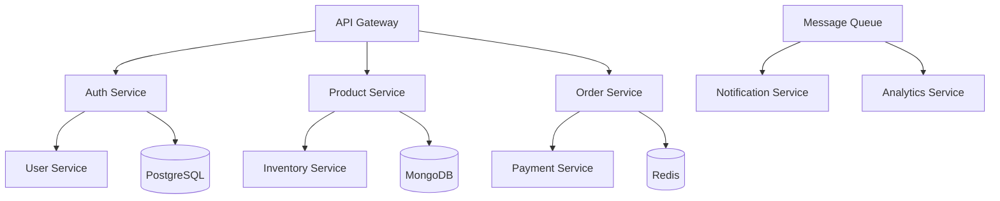

# 🚀 UltraMarket Developer Guide

[](https://docs.ultramarket.uz)
[](https://github.com/ultramarket/backend/blob/main/CONTRIBUTING.md)
[](https://www.typescriptlang.org/)

> **Complete Developer Guide for UltraMarket E-commerce Platform**  
> Everything you need to know to contribute to the project

## 📋 Table of Contents

1. [Getting Started](#getting-started)
2. [Development Environment](#development-environment)
3. [Architecture Overview](#architecture-overview)
4. [Development Workflow](#development-workflow)
5. [Code Standards](#code-standards)
6. [Testing Guidelines](#testing-guidelines)
7. [API Development](#api-development)
8. [Database Guidelines](#database-guidelines)
9. [Frontend Development](#frontend-development)
10. [Deployment Guide](#deployment-guide)
11. [Troubleshooting](#troubleshooting)
12. [Contributing](#contributing)

---

## 🚀 Getting Started

### Prerequisites

Before you begin, ensure you have the following installed:

- **Node.js** 18+ (LTS recommended)
- **npm** 9+ or **yarn** 3+
- **Docker** 20+ and **Docker Compose**
- **Git** 2.30+
- **VS Code** (recommended) with extensions
- **Postman** or **Insomnia** for API testing

### Quick Setup

```bash
# Clone the repository
git clone https://github.com/ultramarket/backend.git
cd backend

# Install dependencies
npm install

# Copy environment files
cp config/environments/development.env.example config/environments/development.env
cp config/environments/test.env.example config/environments/test.env

# Start development environment
npm run dev:setup
npm run dev:start

# Verify installation
npm run test:quick
```

### VS Code Extensions

Install these recommended extensions:

```json
{
  "recommendations": [
    "ms-vscode.vscode-typescript-next",
    "esbenp.prettier-vscode",
    "ms-vscode.vscode-eslint",
    "bradlc.vscode-tailwindcss",
    "ms-vscode.vscode-json",
    "redhat.vscode-yaml",
    "ms-kubernetes-tools.vscode-kubernetes-tools",
    "ms-vscode.vscode-docker",
    "humao.rest-client",
    "github.copilot"
  ]
}
```

---

## 🏗️ Development Environment

### Environment Setup

#### 1. Database Setup

```bash
# Start databases with Docker
docker-compose -f config/docker/docker-compose.databases.yml up -d

# Run migrations
npm run db:migrate

# Seed development data
npm run db:seed:dev
```

#### 2. Service Configuration

```bash
# Start all microservices
npm run services:start

# Start specific service
npm run service:start auth-service
npm run service:start product-service
```

#### 3. Frontend Development

```bash
# Start web application
cd frontend/web-app
npm install
npm run dev

# Start admin panel
cd frontend/admin-panel
npm install
npm run dev
```

### Development Scripts

```bash
# Development
npm run dev              # Start all services in development mode
npm run dev:watch        # Start with file watching
npm run dev:debug        # Start with debugging enabled

# Testing
npm run test             # Run all tests
npm run test:unit        # Run unit tests
npm run test:integration # Run integration tests
npm run test:e2e         # Run end-to-end tests
npm run test:coverage    # Run tests with coverage

# Code Quality
npm run lint             # Run ESLint
npm run lint:fix         # Fix ESLint errors
npm run format           # Format code with Prettier
npm run typecheck        # Run TypeScript type checking

# Database
npm run db:migrate       # Run database migrations
npm run db:seed          # Seed database with test data
npm run db:reset         # Reset database
npm run db:backup        # Create database backup

# Build
npm run build            # Build all services
npm run build:service    # Build specific service
npm run build:frontend   # Build frontend applications
```

---

## 🏛️ Architecture Overview

### Microservices Architecture

```
┌─────────────────────────────────────────────────────────────┐
│                    API Gateway (Kong)                      │
├─────────────────────────────────────────────────────────────┤
│  Core Services        │  Business Services  │  Platform     │
│  ┌─────────────────┐  │  ┌─────────────────┐ │  ┌─────────────┐ │
│  │ Auth Service    │  │  │ Product Service │ │  │ Search      │ │
│  │ User Service    │  │  │ Cart Service    │ │  │ Analytics   │ │
│  │ Config Service  │  │  │ Order Service   │ │  │ Notification│ │
│  │ Store Service   │  │  │ Payment Service │ │  │ File Service│ │
│  └─────────────────┘  │  │ Inventory       │ │  │ Content     │ │
│                       │  │ Review Service  │ │  │ Audit       │ │
│                       │  │ Shipping        │ │  └─────────────┘ │
│                       │  └─────────────────┘ │                 │
├─────────────────────────────────────────────────────────────┤
│              Database Layer (Multi-DB)                     │
│  ┌─────────┐ ┌─────────┐ ┌─────────┐ ┌─────────────────┐   │
│  │PostgreSQL│ │ MongoDB │ │  Redis  │ │  Elasticsearch  │   │
│  └─────────┘ └─────────┘ └─────────┘ └─────────────────┘   │
└─────────────────────────────────────────────────────────────┘
```

### Service Communication



### Technology Stack

#### Backend

- **Runtime**: Node.js 18+ with TypeScript
- **Framework**: Express.js with Fastify for performance-critical services
- **Databases**: PostgreSQL (primary), MongoDB (documents), Redis (cache)
- **Message Queue**: Bull (Redis-based) for background jobs
- **Search**: Elasticsearch for full-text search
- **Authentication**: JWT with refresh tokens
- **Validation**: Joi for request validation
- **Logging**: Winston with structured logging
- **Monitoring**: Prometheus metrics with Grafana dashboards

#### Frontend

- **Web**: React 18+ with TypeScript
- **Mobile**: React Native with Expo
- **Admin**: React with Material-UI
- **State Management**: Redux Toolkit with RTK Query
- **Styling**: Tailwind CSS with custom components
- **Forms**: React Hook Form with Yup validation
- **Testing**: Jest + React Testing Library

#### Infrastructure

- **Containerization**: Docker with multi-stage builds
- **Orchestration**: Kubernetes with Helm charts
- **CI/CD**: GitHub Actions with automated testing
- **Monitoring**: Prometheus + Grafana + AlertManager
- **Logging**: ELK Stack (Elasticsearch, Logstash, Kibana)
- **Security**: OWASP compliance with automated scanning

---

## 🔄 Development Workflow

### Git Workflow

We use **Git Flow** with feature branches:

```bash
# Main branches
main        # Production-ready code
develop     # Integration branch for features
release/*   # Release preparation
hotfix/*    # Emergency fixes

# Feature branches
feature/*   # New features
bugfix/*    # Bug fixes
```

### Branch Naming Convention

```bash
# Feature branches
feature/user-authentication
feature/product-search
feature/payment-integration

# Bug fixes
bugfix/cart-calculation-error
bugfix/login-validation-issue

# Hotfixes
hotfix/security-vulnerability
hotfix/payment-gateway-fix
```

### Commit Message Format

We follow **Conventional Commits** specification:

```bash
# Format
<type>(<scope>): <description>

# Examples
feat(auth): add JWT refresh token functionality
fix(cart): resolve quantity calculation bug
docs(api): update authentication endpoints
test(product): add unit tests for search functionality
refactor(payment): improve error handling
```

### Development Process

1. **Create Feature Branch**

   ```bash
   git checkout develop
   git pull origin develop
   git checkout -b feature/your-feature-name
   ```

2. **Development**

   ```bash
   # Make changes
   npm run dev

   # Run tests
   npm run test

   # Check code quality
   npm run lint
   npm run typecheck
   ```

3. **Commit Changes**

   ```bash
   git add .
   git commit -m "feat(scope): add new feature"
   ```

4. **Push and Create PR**

   ```bash
   git push origin feature/your-feature-name
   # Create Pull Request on GitHub
   ```

5. **Code Review**
   - At least 2 approvals required
   - All tests must pass
   - Code coverage > 80%

6. **Merge to Develop**
   ```bash
   # Squash and merge
   git checkout develop
   git pull origin develop
   ```

---

## 📏 Code Standards

### TypeScript Guidelines

#### 1. Type Definitions

```typescript
// Use interfaces for object shapes
interface User {
  id: string;
  email: string;
  name: string;
  role: UserRole;
  createdAt: Date;
  updatedAt: Date;
}

// Use enums for constants
enum UserRole {
  ADMIN = 'admin',
  VENDOR = 'vendor',
  CUSTOMER = 'customer',
}

// Use utility types
type CreateUserRequest = Omit<User, 'id' | 'createdAt' | 'updatedAt'>;
type UpdateUserRequest = Partial<Pick<User, 'name' | 'email'>>;
```

#### 2. Function Signatures

```typescript
// Use async/await for asynchronous operations
async function createUser(userData: CreateUserRequest): Promise<User> {
  // Implementation
}

// Use proper error handling
async function getUserById(id: string): Promise<User | null> {
  try {
    const user = await userRepository.findById(id);
    return user;
  } catch (error) {
    logger.error('Failed to get user', { id, error });
    throw new UserNotFoundError(`User with id ${id} not found`);
  }
}
```

#### 3. Class Structure

```typescript
export class UserService {
  constructor(
    private readonly userRepository: UserRepository,
    private readonly logger: Logger
  ) {}

  async createUser(userData: CreateUserRequest): Promise<User> {
    this.logger.info('Creating user', { email: userData.email });

    // Validate input
    const validatedData = await this.validateUserData(userData);

    // Check for existing user
    const existingUser = await this.userRepository.findByEmail(userData.email);
    if (existingUser) {
      throw new ConflictError('User already exists');
    }

    // Create user
    const user = await this.userRepository.create(validatedData);

    this.logger.info('User created successfully', { userId: user.id });
    return user;
  }

  private async validateUserData(
    userData: CreateUserRequest
  ): Promise<CreateUserRequest> {
    // Validation logic
    return userData;
  }
}
```

### API Development Standards

#### 1. Controller Structure

```typescript
export class UserController {
  constructor(private readonly userService: UserService) {}

  @Post('/')
  @ValidateBody(CreateUserSchema)
  @ApiResponse({ status: 201, type: User })
  async createUser(
    @Body() userData: CreateUserRequest,
    @Res() res: Response
  ): Promise<void> {
    try {
      const user = await this.userService.createUser(userData);

      res.status(201).json({
        success: true,
        data: user,
        message: 'User created successfully',
      });
    } catch (error) {
      this.handleError(error, res);
    }
  }

  private handleError(error: Error, res: Response): void {
    if (error instanceof ConflictError) {
      res.status(409).json({
        success: false,
        error: 'CONFLICT',
        message: error.message,
      });
    } else {
      res.status(500).json({
        success: false,
        error: 'INTERNAL_SERVER_ERROR',
        message: 'An unexpected error occurred',
      });
    }
  }
}
```

#### 2. Validation Schemas

```typescript
import Joi from 'joi';

export const CreateUserSchema = Joi.object({
  email: Joi.string().email().required(),
  name: Joi.string().min(2).max(50).required(),
  password: Joi.string()
    .min(8)
    .pattern(/^(?=.*[a-z])(?=.*[A-Z])(?=.*\d)/)
    .required(),
  role: Joi.string()
    .valid(...Object.values(UserRole))
    .default(UserRole.CUSTOMER),
});

export const UpdateUserSchema = Joi.object({
  name: Joi.string().min(2).max(50).optional(),
  email: Joi.string().email().optional(),
});
```

#### 3. Error Handling

```typescript
// Custom error classes
export class AppError extends Error {
  constructor(
    public message: string,
    public statusCode: number,
    public code: string
  ) {
    super(message);
    this.name = this.constructor.name;
  }
}

export class ValidationError extends AppError {
  constructor(
    message: string,
    public details?: any
  ) {
    super(message, 400, 'VALIDATION_ERROR');
  }
}

export class NotFoundError extends AppError {
  constructor(message: string) {
    super(message, 404, 'NOT_FOUND');
  }
}

export class ConflictError extends AppError {
  constructor(message: string) {
    super(message, 409, 'CONFLICT');
  }
}
```

### Database Guidelines

#### 1. Repository Pattern

```typescript
export interface UserRepository {
  findById(id: string): Promise<User | null>;
  findByEmail(email: string): Promise<User | null>;
  create(userData: CreateUserRequest): Promise<User>;
  update(id: string, userData: UpdateUserRequest): Promise<User>;
  delete(id: string): Promise<void>;
}

export class PostgresUserRepository implements UserRepository {
  constructor(private readonly db: Database) {}

  async findById(id: string): Promise<User | null> {
    const query = 'SELECT * FROM users WHERE id = $1';
    const result = await this.db.query(query, [id]);
    return result.rows[0] || null;
  }

  async create(userData: CreateUserRequest): Promise<User> {
    const query = `
      INSERT INTO users (email, name, password_hash, role)
      VALUES ($1, $2, $3, $4)
      RETURNING *
    `;
    const result = await this.db.query(query, [
      userData.email,
      userData.name,
      userData.passwordHash,
      userData.role,
    ]);
    return result.rows[0];
  }
}
```

#### 2. Migration Files

```typescript
// migrations/001_create_users_table.ts
import { Knex } from 'knex';

export async function up(knex: Knex): Promise<void> {
  await knex.schema.createTable('users', (table) => {
    table.uuid('id').primary().defaultTo(knex.raw('gen_random_uuid()'));
    table.string('email').unique().notNullable();
    table.string('name').notNullable();
    table.string('password_hash').notNullable();
    table.enum('role', ['admin', 'vendor', 'customer']).defaultTo('customer');
    table.boolean('is_active').defaultTo(true);
    table.timestamp('created_at').defaultTo(knex.fn.now());
    table.timestamp('updated_at').defaultTo(knex.fn.now());

    table.index(['email']);
    table.index(['role']);
    table.index(['created_at']);
  });
}

export async function down(knex: Knex): Promise<void> {
  await knex.schema.dropTable('users');
}
```

---

## 🧪 Testing Guidelines

### Testing Strategy

We follow the **Testing Pyramid** approach:

```
        /\
       /  \
      /E2E \     <- Few, slow, expensive
     /______\
    /        \
   /Integration\ <- Some, medium speed
  /______________\
 /                \
/      Unit        \ <- Many, fast, cheap
/____________________\
```

### Unit Testing

#### 1. Service Tests

```typescript
// tests/services/user.service.test.ts
import { UserService } from '@/services/user.service';
import { UserRepository } from '@/repositories/user.repository';
import { Logger } from '@/utils/logger';

describe('UserService', () => {
  let userService: UserService;
  let mockUserRepository: jest.Mocked<UserRepository>;
  let mockLogger: jest.Mocked<Logger>;

  beforeEach(() => {
    mockUserRepository = {
      findById: jest.fn(),
      findByEmail: jest.fn(),
      create: jest.fn(),
      update: jest.fn(),
      delete: jest.fn(),
    };

    mockLogger = {
      info: jest.fn(),
      error: jest.fn(),
      warn: jest.fn(),
      debug: jest.fn(),
    };

    userService = new UserService(mockUserRepository, mockLogger);
  });

  describe('createUser', () => {
    it('should create a new user successfully', async () => {
      // Arrange
      const userData = {
        email: 'test@example.com',
        name: 'Test User',
        password: 'SecurePass123!',
        role: UserRole.CUSTOMER,
      };

      const expectedUser = {
        id: 'user-123',
        ...userData,
        createdAt: new Date(),
        updatedAt: new Date(),
      };

      mockUserRepository.findByEmail.mockResolvedValue(null);
      mockUserRepository.create.mockResolvedValue(expectedUser);

      // Act
      const result = await userService.createUser(userData);

      // Assert
      expect(result).toEqual(expectedUser);
      expect(mockUserRepository.findByEmail).toHaveBeenCalledWith(
        userData.email
      );
      expect(mockUserRepository.create).toHaveBeenCalledWith(userData);
      expect(mockLogger.info).toHaveBeenCalledWith('Creating user', {
        email: userData.email,
      });
    });

    it('should throw ConflictError when user already exists', async () => {
      // Arrange
      const userData = {
        email: 'existing@example.com',
        name: 'Existing User',
        password: 'SecurePass123!',
        role: UserRole.CUSTOMER,
      };

      mockUserRepository.findByEmail.mockResolvedValue({
        id: 'existing-user',
        ...userData,
        createdAt: new Date(),
        updatedAt: new Date(),
      });

      // Act & Assert
      await expect(userService.createUser(userData)).rejects.toThrow(
        ConflictError
      );
      expect(mockUserRepository.create).not.toHaveBeenCalled();
    });
  });
});
```

#### 2. Controller Tests

```typescript
// tests/controllers/user.controller.test.ts
import request from 'supertest';
import { app } from '@/app';
import { UserService } from '@/services/user.service';

jest.mock('@/services/user.service');

describe('UserController', () => {
  let mockUserService: jest.Mocked<UserService>;

  beforeEach(() => {
    mockUserService = UserService as jest.Mocked<typeof UserService>;
  });

  describe('POST /api/v1/users', () => {
    it('should create a new user', async () => {
      // Arrange
      const userData = {
        email: 'test@example.com',
        name: 'Test User',
        password: 'SecurePass123!',
        role: 'customer',
      };

      const expectedUser = {
        id: 'user-123',
        ...userData,
        createdAt: new Date(),
        updatedAt: new Date(),
      };

      mockUserService.createUser.mockResolvedValue(expectedUser);

      // Act
      const response = await request(app)
        .post('/api/v1/users')
        .send(userData)
        .expect(201);

      // Assert
      expect(response.body).toEqual({
        success: true,
        data: expectedUser,
        message: 'User created successfully',
      });
    });

    it('should return 400 for invalid input', async () => {
      // Arrange
      const invalidUserData = {
        email: 'invalid-email',
        name: '',
        password: '123',
      };

      // Act
      const response = await request(app)
        .post('/api/v1/users')
        .send(invalidUserData)
        .expect(400);

      // Assert
      expect(response.body.success).toBe(false);
      expect(response.body.error).toBe('VALIDATION_ERROR');
    });
  });
});
```

### Integration Testing

```typescript
// tests/integration/user.integration.test.ts
import { TestDatabase } from '@/tests/utils/test-database';
import { app } from '@/app';
import request from 'supertest';

describe('User Integration Tests', () => {
  let testDb: TestDatabase;

  beforeAll(async () => {
    testDb = new TestDatabase();
    await testDb.setup();
  });

  afterAll(async () => {
    await testDb.teardown();
  });

  beforeEach(async () => {
    await testDb.clean();
  });

  describe('User Registration Flow', () => {
    it('should register, verify, and login user', async () => {
      // 1. Register user
      const userData = {
        email: 'test@example.com',
        name: 'Test User',
        password: 'SecurePass123!',
        phone: '+998901234567',
      };

      const registerResponse = await request(app)
        .post('/api/v1/auth/register')
        .send(userData)
        .expect(201);

      expect(registerResponse.body.success).toBe(true);
      expect(registerResponse.body.data.user.email).toBe(userData.email);

      // 2. Verify phone
      const verifyResponse = await request(app)
        .post('/api/v1/auth/verify-phone')
        .send({
          phone: userData.phone,
          verification_code: '123456', // Mock code
        })
        .expect(200);

      expect(verifyResponse.body.success).toBe(true);

      // 3. Login
      const loginResponse = await request(app)
        .post('/api/v1/auth/login')
        .send({
          email: userData.email,
          password: userData.password,
        })
        .expect(200);

      expect(loginResponse.body.success).toBe(true);
      expect(loginResponse.body.data.tokens.access_token).toBeDefined();
    });
  });
});
```

### E2E Testing

```typescript
// tests/e2e/user-journey.e2e.test.ts
import { Browser, Page } from 'playwright';
import { chromium } from 'playwright';

describe('E2E User Journey', () => {
  let browser: Browser;
  let page: Page;

  beforeAll(async () => {
    browser = await chromium.launch();
    page = await browser.newPage();
  });

  afterAll(async () => {
    await browser.close();
  });

  test('Complete shopping journey', async () => {
    // 1. Visit homepage
    await page.goto('http://localhost:3000');
    await expect(page).toHaveTitle(/UltraMarket/);

    // 2. Search for product
    await page.fill('[data-testid="search-input"]', 'Samsung Galaxy');
    await page.click('[data-testid="search-button"]');
    await page.waitForSelector('[data-testid="product-card"]');

    // 3. Add to cart
    await page.click('[data-testid="product-card"]:first-child');
    await page.click('[data-testid="add-to-cart-button"]');
    await page.waitForSelector('[data-testid="cart-notification"]');

    // 4. Go to cart
    await page.click('[data-testid="cart-icon"]');
    await expect(page.locator('[data-testid="cart-item"]')).toBeVisible();

    // 5. Checkout
    await page.click('[data-testid="checkout-button"]');
    await page.waitForURL('**/checkout');

    // 6. Fill shipping information
    await page.fill('[data-testid="shipping-name"]', 'Test User');
    await page.fill('[data-testid="shipping-phone"]', '+998901234567');
    await page.fill('[data-testid="shipping-address"]', 'Test Address');

    // 7. Select payment method
    await page.click('[data-testid="payment-click"]');

    // 8. Place order
    await page.click('[data-testid="place-order-button"]');
    await page.waitForURL('**/order-confirmation');

    // 9. Verify order confirmation
    await expect(page.locator('[data-testid="order-success"]')).toBeVisible();
  });
});
```

---

## 🗄️ Database Guidelines

### Database Design Principles

1. **Normalization**: Follow 3NF for transactional data
2. **Denormalization**: Use strategically for read-heavy operations
3. **Indexing**: Create indexes for frequently queried columns
4. **Constraints**: Use database constraints for data integrity
5. **Migrations**: All schema changes through migrations

### PostgreSQL Best Practices

```sql
-- Use proper data types
CREATE TABLE users (
    id UUID PRIMARY KEY DEFAULT gen_random_uuid(),
    email VARCHAR(255) UNIQUE NOT NULL,
    name VARCHAR(100) NOT NULL,
    password_hash VARCHAR(255) NOT NULL,
    role user_role DEFAULT 'customer',
    is_active BOOLEAN DEFAULT true,
    created_at TIMESTAMP WITH TIME ZONE DEFAULT CURRENT_TIMESTAMP,
    updated_at TIMESTAMP WITH TIME ZONE DEFAULT CURRENT_TIMESTAMP
);

-- Create indexes for performance
CREATE INDEX idx_users_email ON users(email);
CREATE INDEX idx_users_role ON users(role);
CREATE INDEX idx_users_created_at ON users(created_at);

-- Use constraints for data integrity
ALTER TABLE orders
ADD CONSTRAINT chk_orders_total_positive
CHECK (total_amount > 0);

-- Use triggers for automatic updates
CREATE OR REPLACE FUNCTION update_updated_at_column()
RETURNS TRIGGER AS $$
BEGIN
    NEW.updated_at = CURRENT_TIMESTAMP;
    RETURN NEW;
END;
$$ language 'plpgsql';

CREATE TRIGGER update_users_updated_at
    BEFORE UPDATE ON users
    FOR EACH ROW EXECUTE FUNCTION update_updated_at_column();
```

### MongoDB Best Practices

```javascript
// Use proper schema design
const userSchema = new mongoose.Schema({
  _id: { type: String, default: () => new mongoose.Types.ObjectId() },
  email: { type: String, required: true, unique: true, lowercase: true },
  name: { type: String, required: true, trim: true },
  profile: {
    avatar: String,
    bio: String,
    preferences: {
      language: { type: String, enum: ['uz', 'ru', 'en'], default: 'uz' },
      currency: { type: String, enum: ['UZS', 'USD'], default: 'UZS' },
      notifications: {
        email: { type: Boolean, default: true },
        sms: { type: Boolean, default: true },
        push: { type: Boolean, default: true },
      },
    },
  },
  addresses: [
    {
      type: { type: String, enum: ['home', 'work', 'other'], required: true },
      street: { type: String, required: true },
      city: { type: String, required: true },
      region: { type: String, required: true },
      postalCode: String,
      isDefault: { type: Boolean, default: false },
    },
  ],
  createdAt: { type: Date, default: Date.now },
  updatedAt: { type: Date, default: Date.now },
});

// Create indexes
userSchema.index({ email: 1 });
userSchema.index({ 'profile.preferences.language': 1 });
userSchema.index({ createdAt: -1 });

// Use pre-save middleware
userSchema.pre('save', function (next) {
  this.updatedAt = new Date();
  next();
});
```

---

## 🎨 Frontend Development

### React Component Structure

```typescript
// components/ProductCard/ProductCard.tsx
import React from 'react';
import { Product } from '@/types/product';
import { useCart } from '@/hooks/useCart';
import { formatPrice } from '@/utils/format';
import { Button } from '@/components/ui/Button';
import { Badge } from '@/components/ui/Badge';
import styles from './ProductCard.module.css';

interface ProductCardProps {
  product: Product;
  onViewDetails: (productId: string) => void;
}

export const ProductCard: React.FC<ProductCardProps> = ({
  product,
  onViewDetails
}) => {
  const { addToCart, isLoading } = useCart();

  const handleAddToCart = async () => {
    try {
      await addToCart({
        productId: product.id,
        quantity: 1
      });
    } catch (error) {
      console.error('Failed to add to cart:', error);
    }
  };

  return (
    <div className={styles.card} data-testid="product-card">
      <div className={styles.imageContainer}>
        
        {product.discountPercentage > 0 && (
          <Badge variant="discount" className={styles.discountBadge}>
            -{product.discountPercentage}%
          </Badge>
        )}
      </div>

      <div className={styles.content}>
        <h3 className={styles.title}>{product.name}</h3>
        <p className={styles.description}>{product.description}</p>

        <div className={styles.pricing}>
          <span className={styles.currentPrice}>
            {formatPrice(product.price, product.currency)}
          </span>
          {product.originalPrice > product.price && (
            <span className={styles.originalPrice}>
              {formatPrice(product.originalPrice, product.currency)}
            </span>
          )}
        </div>

        <div className={styles.actions}>
          <Button
            variant="outline"
            onClick={() => onViewDetails(product.id)}
            data-testid="view-details-button"
          >
            View Details
          </Button>
          <Button
            variant="primary"
            onClick={handleAddToCart}
            disabled={isLoading || product.stock.quantity === 0}
            data-testid="add-to-cart-button"
          >
            {product.stock.quantity === 0 ? 'Out of Stock' : 'Add to Cart'}
          </Button>
        </div>
      </div>
    </div>
  );
};
```

### Custom Hooks

```typescript
// hooks/useCart.ts
import { useState, useCallback } from 'react';
import { useMutation, useQuery, useQueryClient } from '@tanstack/react-query';
import { cartService } from '@/services/cart.service';
import { AddToCartRequest, Cart } from '@/types/cart';
import { useNotification } from '@/hooks/useNotification';

export const useCart = () => {
  const queryClient = useQueryClient();
  const { showNotification } = useNotification();

  const {
    data: cart,
    isLoading: isCartLoading,
    error: cartError,
  } = useQuery({
    queryKey: ['cart'],
    queryFn: cartService.getCart,
    staleTime: 5 * 60 * 1000, // 5 minutes
  });

  const addToCartMutation = useMutation({
    mutationFn: cartService.addToCart,
    onSuccess: (data) => {
      queryClient.setQueryData(['cart'], data);
      showNotification({
        type: 'success',
        message: 'Product added to cart successfully',
      });
    },
    onError: (error) => {
      showNotification({
        type: 'error',
        message: 'Failed to add product to cart',
      });
    },
  });

  const updateQuantityMutation = useMutation({
    mutationFn: ({ itemId, quantity }: { itemId: string; quantity: number }) =>
      cartService.updateQuantity(itemId, quantity),
    onSuccess: (data) => {
      queryClient.setQueryData(['cart'], data);
    },
  });

  const removeFromCartMutation = useMutation({
    mutationFn: cartService.removeFromCart,
    onSuccess: (data) => {
      queryClient.setQueryData(['cart'], data);
      showNotification({
        type: 'success',
        message: 'Product removed from cart',
      });
    },
  });

  const addToCart = useCallback(
    (request: AddToCartRequest) => addToCartMutation.mutateAsync(request),
    [addToCartMutation]
  );

  const updateQuantity = useCallback(
    (itemId: string, quantity: number) =>
      updateQuantityMutation.mutateAsync({ itemId, quantity }),
    [updateQuantityMutation]
  );

  const removeFromCart = useCallback(
    (itemId: string) => removeFromCartMutation.mutateAsync(itemId),
    [removeFromCartMutation]
  );

  return {
    cart,
    isLoading: isCartLoading,
    error: cartError,
    addToCart,
    updateQuantity,
    removeFromCart,
    isAddingToCart: addToCartMutation.isPending,
    isUpdatingQuantity: updateQuantityMutation.isPending,
    isRemoving: removeFromCartMutation.isPending,
  };
};
```

---

## 🚀 Deployment Guide

### Local Development

```bash
# Start all services
npm run dev

# Start specific service
npm run service:start auth-service

# Start with debugging
npm run dev:debug

# Start with profiling
npm run dev:profile
```

### Staging Deployment

```bash
# Build for staging
npm run build:staging

# Deploy to staging
npm run deploy:staging

# Run staging tests
npm run test:staging
```

### Production Deployment

```bash
# Build for production
npm run build:production

# Run production deployment
./scripts/production/final-production-deployment.sh

# Verify deployment
./scripts/validation/production-readiness-check.sh
```

---

## 🔧 Troubleshooting

### Common Issues

#### 1. Database Connection Issues

```bash
# Check database status
docker-compose ps

# Restart databases
docker-compose restart postgres mongodb redis

# Check logs
docker-compose logs postgres
```

#### 2. Service Not Starting

```bash
# Check port conflicts
lsof -i :3000

# Check service logs
npm run service:logs auth-service

# Restart service
npm run service:restart auth-service
```

#### 3. Test Failures

```bash
# Run specific test
npm run test -- --testNamePattern="UserService"

# Run tests with debugging
npm run test:debug

# Clear test cache
npm run test:clear-cache
```

#### 4. Build Issues

```bash
# Clean build cache
npm run clean

# Rebuild dependencies
rm -rf node_modules package-lock.json
npm install

# Check TypeScript errors
npm run typecheck
```

### Debugging Tips

1. **Use VS Code Debugger**

   ```json
   {
     "type": "node",
     "request": "launch",
     "name": "Debug Service",
     "program": "${workspaceFolder}/microservices/auth-service/src/index.ts",
     "env": {
       "NODE_ENV": "development"
     }
   }
   ```

2. **Enable Debug Logging**

   ```bash
   DEBUG=ultramarket:* npm run dev
   ```

3. **Use Chrome DevTools**
   ```bash
   node --inspect-brk ./dist/index.js
   ```

---

## 🤝 Contributing

### Before Contributing

1. **Read the Code of Conduct**
2. **Check existing issues and PRs**
3. **Discuss major changes in issues first**
4. **Follow the development workflow**

### Pull Request Process

1. **Fork and clone the repository**
2. **Create a feature branch**
3. **Make your changes**
4. **Add tests for new functionality**
5. **Ensure all tests pass**
6. **Update documentation**
7. **Submit a pull request**

### Code Review Checklist

- [ ] Code follows style guidelines
- [ ] Tests are included and passing
- [ ] Documentation is updated
- [ ] No breaking changes (or properly documented)
- [ ] Security considerations addressed
- [ ] Performance impact considered

### Getting Help

- **Discord**: https://discord.gg/ultramarket
- **GitHub Discussions**: https://github.com/ultramarket/backend/discussions
- **Email**: dev@ultramarket.uz

---

## 📚 Additional Resources

### Learning Resources

- **TypeScript**: https://www.typescriptlang.org/docs/
- **Node.js**: https://nodejs.org/en/docs/
- **React**: https://reactjs.org/docs/
- **Docker**: https://docs.docker.com/
- **Kubernetes**: https://kubernetes.io/docs/

### Tools & Extensions

- **VS Code**: https://code.visualstudio.com/
- **Postman**: https://www.postman.com/
- **Docker Desktop**: https://www.docker.com/products/docker-desktop
- **Kubernetes Dashboard**: https://kubernetes.io/docs/tasks/access-application-cluster/web-ui-dashboard/

### Community

- **GitHub**: https://github.com/ultramarket
- **Discord**: https://discord.gg/ultramarket
- **Twitter**: https://twitter.com/ultramarket_uz

---

**🚀 Happy Coding! Welcome to the UltraMarket development team!**

_Last updated: $(date)_  
_Version: 1.0.0_  
_Maintainer: UltraMarket Development Team_
