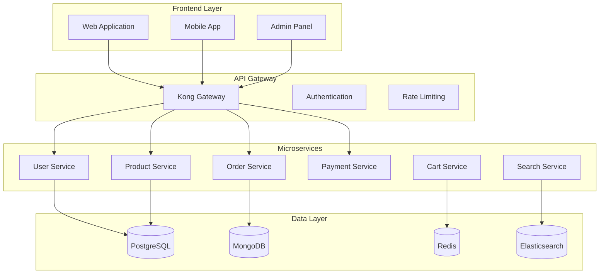

# 👥 UltraMarket User Training & Operational Guide

## 📚 Training Program Overview

Bu comprehensive training guide UltraMarket e-commerce platform ning barcha foydalanuvchi darajalarini qamrab oladi. Professional operational procedures va best practices ni o'rgatish uchun mo'ljallangan.

### 🎯 Target Audiences

| Role                      | Training Level | Duration | Prerequisites              |
| ------------------------- | -------------- | -------- | -------------------------- |
| **System Administrators** | Advanced       | 40 hours | Linux, Docker, Kubernetes  |
| **DevOps Engineers**      | Expert         | 60 hours | CI/CD, Cloud platforms     |
| **Developers**            | Intermediate   | 30 hours | Node.js, TypeScript, React |
| **Business Users**        | Basic          | 16 hours | E-commerce basics          |
| **Support Staff**         | Intermediate   | 24 hours | Customer service           |

## 🏗️ System Architecture Training

### Module 1: Platform Overview



#### Training Objectives:

- ✅ Understand microservices architecture
- ✅ Learn API Gateway patterns
- ✅ Database selection rationale
- ✅ Security implementation
- ✅ Scalability principles

#### Hands-on Exercise 1: Architecture Walkthrough

```bash
# Explore system components
kubectl get pods -n ultramarket-production
kubectl get services -n ultramarket-production
kubectl describe deployment product-service

# Check service health
curl -f https://api.ultramarket.com/health
curl -f https://api.ultramarket.com/v2/products?limit=5
```

### Module 2: Database Management

#### PostgreSQL Operations

```sql
-- Database monitoring queries
SELECT schemaname, tablename, n_tup_ins, n_tup_upd, n_tup_del
FROM pg_stat_user_tables
ORDER BY n_tup_ins DESC;

-- Index usage analysis
SELECT schemaname, tablename, indexname, idx_scan, idx_tup_read
FROM pg_stat_user_indexes
WHERE idx_scan = 0;

-- Connection monitoring
SELECT count(*) as active_connections, state
FROM pg_stat_activity
GROUP BY state;
```

#### MongoDB Operations

```javascript
// Database health check
db.runCommand({ serverStatus: 1 });

// Collection statistics
db.products.stats();

// Query performance analysis
db.products.explain('executionStats').find({ category: 'electronics' });

// Index management
db.products.createIndex({ name: 'text', description: 'text' });
```

#### Redis Operations

```bash
# Redis monitoring commands
redis-cli info memory
redis-cli info stats
redis-cli info replication

# Cache analysis
redis-cli --scan --pattern "cart:*" | head -10
redis-cli ttl "session:user123"

# Performance testing
redis-cli --latency -i 1
```

## 🚀 DevOps Operations Training

### Module 3: Deployment Procedures

#### Kubernetes Deployment

```yaml
# Sample deployment update
apiVersion: apps/v1
kind: Deployment
metadata:
  name: product-service
  namespace: ultramarket-production
spec:
  replicas: 3
  strategy:
    type: RollingUpdate
    rollingUpdate:
      maxUnavailable: 1
      maxSurge: 1
  template:
    spec:
      containers:
        - name: product-service
          image: ultramarket/product-service:v2.1.0
          resources:
            requests:
              memory: '256Mi'
              cpu: '250m'
            limits:
              memory: '512Mi'
              cpu: '500m'
```

#### Deployment Commands

```bash
# Safe deployment procedure
kubectl set image deployment/product-service \
  product-service=ultramarket/product-service:v2.1.0 \
  -n ultramarket-production

# Monitor rollout
kubectl rollout status deployment/product-service -n ultramarket-production

# Rollback if needed
kubectl rollout undo deployment/product-service -n ultramarket-production

# Scale services
kubectl scale deployment product-service --replicas=5 -n ultramarket-production
```

### Module 4: Monitoring & Alerting

#### Grafana Dashboard Navigation

```typescript
// Key metrics to monitor
const keyMetrics = {
  application: {
    responseTime: 'avg(http_request_duration_seconds)',
    errorRate: 'rate(http_requests_total{status=~"5.."}[5m])',
    throughput: 'rate(http_requests_total[5m])',
  },
  infrastructure: {
    cpuUsage: 'avg(cpu_usage_percent)',
    memoryUsage: 'avg(memory_usage_percent)',
    diskUsage: 'avg(disk_usage_percent)',
  },
  business: {
    activeUsers: 'count(active_sessions)',
    salesRevenue: 'sum(order_total_amount)',
    conversionRate: 'orders_completed / sessions_started',
  },
};
```

#### Alert Investigation Process

```bash
# Alert investigation checklist
echo "1. Check alert details in AlertManager"
curl -s http://alertmanager:9093/api/v1/alerts

echo "2. Verify service health"
kubectl get pods -n ultramarket-production | grep -v Running

echo "3. Check recent deployments"
kubectl rollout history deployment/product-service -n ultramarket-production

echo "4. Review logs"
kubectl logs -f deployment/product-service -n ultramarket-production --tail=100

echo "5. Check resource usage"
kubectl top pods -n ultramarket-production
```

## 🛡️ Security Operations Training

### Module 5: Security Best Practices

#### Access Management

```bash
# User access review
kubectl get rolebindings -n ultramarket-production
kubectl describe rolebinding developer-access -n ultramarket-production

# Service account management
kubectl get serviceaccounts -n ultramarket-production
kubectl describe sa product-service-sa -n ultramarket-production

# Secret management
kubectl get secrets -n ultramarket-production
kubectl describe secret app-secrets -n ultramarket-production
```

#### Security Incident Response

```python
#!/usr/bin/env python3
"""
Security Incident Response Playbook
"""

class SecurityIncidentHandler:
    def __init__(self):
        self.severity_levels = {
            'P0': 'Critical - Data breach, system compromise',
            'P1': 'High - Authentication bypass, privilege escalation',
            'P2': 'Medium - Suspicious activity, potential threat',
            'P3': 'Low - Security policy violation, minor issue'
        }

    def handle_incident(self, incident_type: str, severity: str):
        """Standard incident response procedure"""

        # Step 1: Immediate containment
        if severity in ['P0', 'P1']:
            self.immediate_containment(incident_type)

        # Step 2: Investigation
        self.investigate_incident(incident_type)

        # Step 3: Evidence collection
        self.collect_evidence()

        # Step 4: Communication
        self.notify_stakeholders(severity)

        # Step 5: Recovery
        self.initiate_recovery()

        # Step 6: Post-incident review
        self.conduct_review()

    def immediate_containment(self, incident_type: str):
        """Immediate containment actions"""
        actions = {
            'unauthorized_access': [
                'Disable affected user accounts',
                'Reset all admin passwords',
                'Enable additional MFA',
                'Block suspicious IP addresses'
            ],
            'data_breach': [
                'Isolate affected systems',
                'Preserve evidence',
                'Notify legal team',
                'Prepare breach notifications'
            ],
            'malware_detected': [
                'Quarantine affected systems',
                'Run full antivirus scan',
                'Check for lateral movement',
                'Update security rules'
            ]
        }

        return actions.get(incident_type, [])
```

### Module 6: Compliance Training

#### GDPR Compliance Operations

```typescript
// GDPR data handling procedures
class GDPRCompliance {
  // Data subject rights implementation
  async handleDataSubjectRequest(requestType: string, userId: string) {
    switch (requestType) {
      case 'access':
        return await this.exportUserData(userId);
      case 'rectification':
        return await this.updateUserData(userId);
      case 'erasure':
        return await this.deleteUserData(userId);
      case 'portability':
        return await this.exportPortableData(userId);
      default:
        throw new Error('Invalid request type');
    }
  }

  async exportUserData(userId: string) {
    // Collect all user data from different services
    const userData = {
      profile: await userService.getProfile(userId),
      orders: await orderService.getUserOrders(userId),
      preferences: await preferenceService.getPreferences(userId),
      analytics: await analyticsService.getUserAnalytics(userId),
    };

    return this.formatForExport(userData);
  }

  async deleteUserData(userId: string) {
    // GDPR-compliant data deletion
    await Promise.all([
      userService.anonymizeUser(userId),
      orderService.anonymizeOrders(userId),
      analyticsService.deleteUserAnalytics(userId),
      cacheService.clearUserData(userId),
    ]);

    // Log deletion for audit
    await auditService.logDataDeletion(userId, 'GDPR_REQUEST');
  }
}
```

## 👨‍💼 Business User Training

### Module 7: Admin Panel Operations

#### Product Management

```typescript
// Product management workflows
interface ProductManagementWorkflow {
  // Add new product
  createProduct: {
    requiredFields: ['name', 'description', 'price', 'category'];
    validationRules: ['price > 0', 'name.length >= 3'];
    approvalProcess: 'auto' | 'manual';
    seoOptimization: ['meta_title', 'meta_description', 'url_slug'];
  };

  // Update existing product
  updateProduct: {
    versioning: true;
    auditTrail: true;
    bulkOperations: ['price_update', 'category_change', 'status_change'];
    rollbackCapability: true;
  };

  // Inventory management
  inventoryManagement: {
    stockLevels: 'real_time';
    lowStockAlerts: 'automatic';
    reservationSystem: true;
    multiWarehouse: true;
  };
}
```

#### Order Management

```sql
-- Useful order management queries
-- Daily sales report
SELECT
    DATE(created_at) as date,
    COUNT(*) as total_orders,
    SUM(total_amount) as revenue,
    AVG(total_amount) as avg_order_value
FROM orders
WHERE created_at >= CURRENT_DATE - INTERVAL '30 days'
GROUP BY DATE(created_at)
ORDER BY date DESC;

-- Top selling products
SELECT
    p.name,
    SUM(oi.quantity) as total_sold,
    SUM(oi.price * oi.quantity) as revenue
FROM order_items oi
JOIN products p ON oi.product_id = p.id
JOIN orders o ON oi.order_id = o.id
WHERE o.created_at >= CURRENT_DATE - INTERVAL '7 days'
GROUP BY p.id, p.name
ORDER BY total_sold DESC
LIMIT 10;

-- Customer analytics
SELECT
    COUNT(DISTINCT customer_id) as unique_customers,
    COUNT(*) as total_orders,
    AVG(total_amount) as avg_order_value,
    COUNT(*) / COUNT(DISTINCT customer_id) as orders_per_customer
FROM orders
WHERE created_at >= CURRENT_DATE - INTERVAL '30 days';
```

### Module 8: Customer Support Operations

#### Support Ticket Management

```typescript
// Customer support workflow
class CustomerSupport {
  ticketPriorities = {
    P1: 'Payment issues, system down',
    P2: 'Order problems, account issues',
    P3: 'General inquiries, feature requests',
    P4: 'Documentation, how-to questions',
  };

  responseTimeTargets = {
    P1: '15 minutes',
    P2: '2 hours',
    P3: '24 hours',
    P4: '48 hours',
  };

  async handleTicket(ticket: SupportTicket) {
    // Auto-categorize ticket
    const category = await this.categorizeTicket(ticket);

    // Assign priority
    const priority = this.assignPriority(category);

    // Route to appropriate team
    const assignee = await this.routeTicket(category, priority);

    // Set up escalation
    this.setupEscalation(ticket, priority);

    return {
      ticketId: ticket.id,
      category,
      priority,
      assignee,
      responseTimeTarget: this.responseTimeTargets[priority],
    };
  }

  async escalateTicket(ticketId: string) {
    const ticket = await this.getTicket(ticketId);

    // Escalation matrix
    const escalationRules = {
      P1: 'immediate_manager',
      P2: 'senior_support',
      P3: 'team_lead',
      P4: 'knowledge_base',
    };

    return this.assignToEscalation(ticket, escalationRules[ticket.priority]);
  }
}
```

## 📊 Performance Optimization Training

### Module 9: Performance Monitoring

#### Application Performance Monitoring

```bash
# Performance monitoring commands
echo "=== Application Metrics ==="
curl -s http://prometheus:9090/api/v1/query?query=http_request_duration_seconds_bucket

echo "=== Database Performance ==="
kubectl exec -it postgresql-0 -n ultramarket-production -- \
  psql -U postgres -c "SELECT query, mean_time, calls FROM pg_stat_statements ORDER BY mean_time DESC LIMIT 10;"

echo "=== Cache Hit Rates ==="
redis-cli info stats | grep keyspace_hits
redis-cli info stats | grep keyspace_misses

echo "=== Memory Usage ==="
kubectl top pods -n ultramarket-production --sort-by=memory
```

#### Performance Optimization Checklist

```python
#!/usr/bin/env python3
"""
Performance Optimization Checklist
"""

class PerformanceOptimizer:
    def __init__(self):
        self.optimization_areas = [
            'database_queries',
            'caching_strategy',
            'api_response_times',
            'frontend_performance',
            'resource_utilization'
        ]

    def analyze_database_performance(self):
        """Database performance analysis"""
        checks = {
            'slow_queries': 'Identify queries > 1 second',
            'missing_indexes': 'Find tables without proper indexes',
            'connection_pooling': 'Verify connection pool settings',
            'query_optimization': 'Review query execution plans'
        }
        return checks

    def analyze_caching_strategy(self):
        """Cache performance analysis"""
        checks = {
            'hit_rate': 'Target > 80% cache hit rate',
            'ttl_optimization': 'Review cache expiration times',
            'cache_invalidation': 'Verify cache invalidation logic',
            'memory_usage': 'Monitor cache memory consumption'
        }
        return checks

    def generate_optimization_report(self):
        """Generate performance optimization report"""
        return {
            'database': self.analyze_database_performance(),
            'caching': self.analyze_caching_strategy(),
            'recommendations': self.get_recommendations(),
            'action_items': self.create_action_items()
        }
```

## 🔧 Troubleshooting Training

### Module 10: Common Issues & Solutions

#### Issue Resolution Matrix

| Issue Category              | Symptoms       | Common Causes                        | Resolution Steps                                                         |
| --------------------------- | -------------- | ------------------------------------ | ------------------------------------------------------------------------ |
| **High Response Time**      | API calls > 1s | Database bottleneck, Missing indexes | 1. Check DB queries<br>2. Review indexes<br>3. Scale services            |
| **Service Unavailable**     | 5xx errors     | Pod crashes, Resource limits         | 1. Check pod status<br>2. Review logs<br>3. Check resources              |
| **Authentication Failures** | 401/403 errors | Token expiry, JWT issues             | 1. Verify tokens<br>2. Check auth service<br>3. Review permissions       |
| **Payment Failures**        | Payment errors | Gateway issues, API limits           | 1. Check Stripe status<br>2. Review rate limits<br>3. Verify credentials |

#### Debugging Commands

```bash
#!/bin/bash
# UltraMarket debugging toolkit

echo "=== System Health Check ==="
kubectl get pods -n ultramarket-production | grep -v Running
kubectl get services -n ultramarket-production
kubectl get ingress -n ultramarket-production

echo "=== Service Logs ==="
kubectl logs -f deployment/product-service -n ultramarket-production --tail=50

echo "=== Resource Usage ==="
kubectl top pods -n ultramarket-production
kubectl top nodes

echo "=== Network Connectivity ==="
kubectl exec -it product-service-0 -n ultramarket-production -- \
  curl -I http://postgresql:5432

echo "=== Database Connectivity ==="
kubectl exec -it postgresql-0 -n ultramarket-production -- \
  pg_isready -h localhost -p 5432

echo "=== Cache Status ==="
kubectl exec -it redis-master-0 -n ultramarket-production -- \
  redis-cli ping
```

## 📋 Training Assessment & Certification

### Competency Levels

#### Level 1: Basic Operations

- ✅ Navigate admin panel
- ✅ Perform basic CRUD operations
- ✅ Understand system architecture
- ✅ Follow standard procedures

#### Level 2: Intermediate Operations

- ✅ Troubleshoot common issues
- ✅ Monitor system performance
- ✅ Manage user accounts
- ✅ Handle customer support

#### Level 3: Advanced Operations

- ✅ Optimize database performance
- ✅ Implement security measures
- ✅ Manage deployments
- ✅ Incident response

#### Level 4: Expert Operations

- ✅ Design system improvements
- ✅ Lead incident response
- ✅ Train other users
- ✅ Make architectural decisions

### Certification Exam

```typescript
// Sample certification questions
const certificationQuestions = {
  systemArchitecture: [
    {
      question: 'What is the purpose of the API Gateway in UltraMarket?',
      options: [
        'Load balancing',
        'Authentication',
        'Rate limiting',
        'All of the above',
      ],
      correct: 3,
      level: 'basic',
    },
    {
      question: 'How do you perform a zero-downtime deployment?',
      explanation: 'Rolling update strategy with proper health checks',
      level: 'advanced',
    },
  ],
  security: [
    {
      question:
        'What should be your first action when detecting a security incident?',
      options: [
        'Document evidence',
        'Contain the threat',
        'Notify management',
        'Fix the vulnerability',
      ],
      correct: 1,
      level: 'intermediate',
    },
  ],
  troubleshooting: [
    {
      question:
        'A service is returning 500 errors. What are your debugging steps?',
      type: 'essay',
      level: 'advanced',
    },
  ],
};
```

## 📚 Additional Resources

### Documentation Links

- **API Documentation**: `/docs/api/`
- **System Architecture**: `/docs/architecture/`
- **Security Guidelines**: `/docs/security/`
- **Troubleshooting Guide**: `/docs/troubleshooting/`

### Training Materials

- **Video Tutorials**: Internal training portal
- **Hands-on Labs**: Staging environment access
- **Knowledge Base**: Confluence wiki
- **Best Practices**: Technical blog

### Support Channels

- **Technical Support**: #tech-support Slack channel
- **Training Questions**: #training-help Slack channel
- **Emergency Escalation**: On-call rotation
- **Documentation Updates**: #docs-updates Slack channel

---

**🎓 UltraMarket Training Program - Building expertise for operational excellence**
